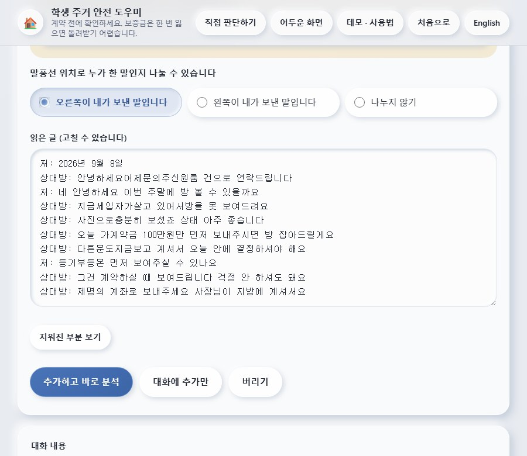
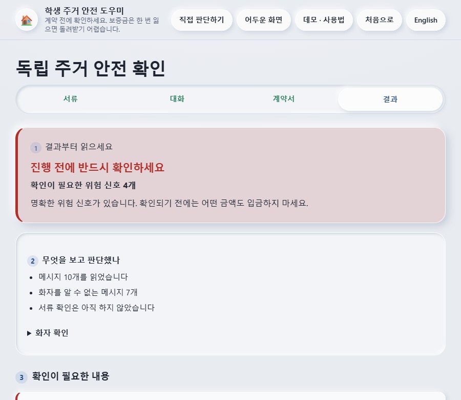
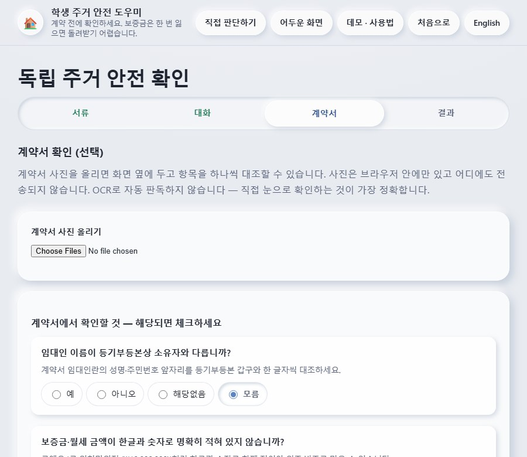
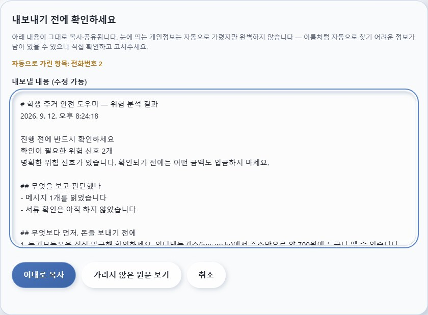
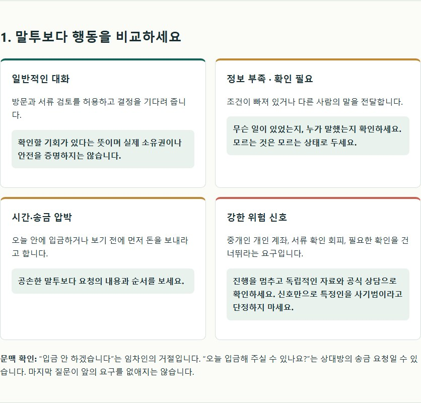
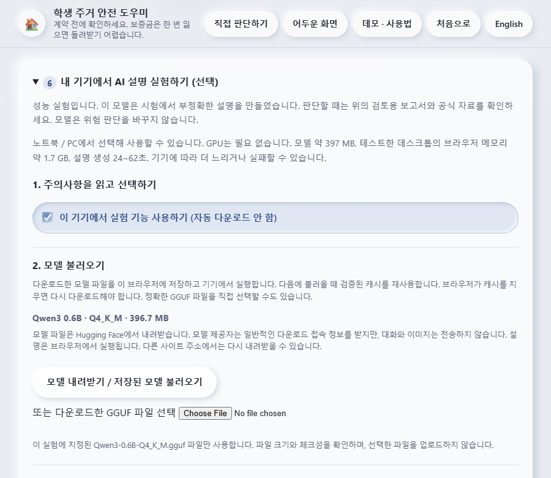

# 3. 주요 기능 소개

<!-- submission-format: font=Malgun Gothic; font-size=9pt; line-spacing=1.0 -->

**프로젝트:** 학생 주거 안전 도우미

**제작자:** Bui Xuan Mai

**웹사이트:** https://s0lluxx26.github.io/Project_web_student_support/

**GitHub 저장소:** https://github.com/S0lluxx26/Project_web_student_support

**화면 출처:** 2026년 9월 12일, 구현된 웹앱을 로컬 HTTP 서버와 Chromium에서 실행하여 직접 캡처했다. 대화와 연락처는 가상 시연 자료이며, 압박·일반 사례의 OCR 초안은 수정하지 않았다.

## 3.1. 채팅 스크린샷 문자 추출 및 검토

### 화면

**기능명:** 채팅 스크린샷 OCR 및 대화 입력

**기능 설명:** 사용자가 대화를 붙여 넣거나 채팅 스크린샷을 선택하면 분석할 글을 준비할 수 있다. OCR로 읽은 글은 바로 판정하지 않고 편집 가능한 검토 화면에 표시하며, 사용자가 자신이 보낸 말풍선의 방향을 선택하고 글을 수정한 뒤 분석한다.

**구현 결과:** 가상 카카오톡 이미지의 한국어 대화가 실제로 추출되었으며, 화면에 화자 선택, 글 수정, 분석 실행 버튼이 표시되었다. 문자 인식과 대화 분석은 브라우저에서 처리한다.

**확인할 점:** OCR은 글자·금액·부정어를 잘못 읽을 수 있으므로 원본과 대조해야 한다.

## 3.2. 대화의 위험 신호 분석

### 화면

**기능명:** 근거를 제시하는 대화 위험 신호 분석

**기능 설명:** 검토한 대화에 규칙을 적용하여 입금 압박, 소유자 명의가 아닌 계좌로의 송금 요구 등 확인이 필요한 표현을 찾는다. 결과 화면은 경고 수준과 신호 수를 먼저 보여 주고, 관련 문장과 추가 확인 항목을 제공한다.

**구현 결과:** 압박 사례에서는 위험 신호 4개가 표시되었다. 같은 절차로 실행한 일반 사례에서는 알려진 위험 신호가 0개였으며, 두 결과를 캡처 기록에 저장했다.

**확인할 점:** 이는 규칙에 따른 위험 신호 안내이며 사기 확정이나 안전 보증이 아니다. 화자가 불명확한 문장과 확인하지 않은 서류도 결과에서 구분한다.

## 3.3. 계약서와 확인 항목 검토

### 화면

**기능명:** 계약서 사진 대조 및 확인 항목 입력

**기능 설명:** 계약서 사진을 브라우저에서 보면서 임대인 이름, 보증금·월세 등 확인 항목을 직접 대조할 수 있다. 사용자는 각 항목을 예, 아니요, 해당없음, 모름으로 구분하여 입력한다.

**구현 결과:** 사진 선택 기능과 확인 항목이 구현되어 있으며, 확인하지 않은 항목은 기본적으로 모름으로 표시된다. 첨부 화면은 실제 계약서를 업로드하지 않은 초기 상태이다.

**확인할 점:** 계약서 사진의 자동 OCR이나 문서 진위 판별 기능은 제공하지 않는다.

## 3.4. 내보내기 미리보기와 개인정보 가리기

### 화면

**기능명:** 개인정보를 가린 결과 확인 및 복사

**기능 설명:** 결과를 복사하거나 공유하기 전에 내보낼 내용을 미리 보여 준다. 전화번호 등 인식 가능한 개인정보를 자동으로 가리고, 사용자가 내용을 수정하거나 취소할 수 있도록 한다.

**구현 결과:** 별도의 가상 연락처가 포함된 대화를 분석하자, 결과의 두 인용 위치에 반복된 같은 전화번호가 가려졌다. 화면의 ‘전화번호 2’는 서로 다른 연락처 2개가 아니라 가린 출현 횟수이며, 미리보기에서 원래 번호가 사라진 것을 확인했다.

**확인할 점:** 이름 등 일부 정보는 자동으로 찾지 못할 수 있으므로 사용자가 최종 내용을 확인해야 한다. 캡처 과정에서는 실제 복사·공유를 실행하지 않았다.

## 3.5. 안전 판단 도움말과 예시 학습

### 화면

**기능명:** 위험 상황 비교 및 가상 스크린샷 연습

**기능 설명:** 일반적인 대화, 정보 부족, 시간·송금 압박, 강한 위험 신호를 비교하여 사용자가 요청의 내용과 문맥을 살펴보도록 돕는다. 같은 도움말 페이지에서 가상 스크린샷을 내려받고 원문과 비교하며 OCR 기능을 연습할 수 있다.

**구현 결과:** 네 가지 상황의 비교 카드와 확인 방법이 표시되었으며, 페이지에 학습용 가상 예시 12개가 실제로 로드되는 것을 확인했다. 웹사이트는 한국어·영어 전환과 밝은 화면·어두운 화면 전환도 제공한다.

**확인할 점:** 가상 예시의 결과는 학습용이며 실제 사기 탐지 정확도를 나타내지 않는다.

## 3.6. 선택형 PC AI 설명 도우미

### 화면

**기능명:** 기기 내 AI 설명 초안 생성 실험

**기능 설명:** 노트북·PC 사용자가 선택한 경고에 대한 설명 초안을 요청할 수 있는 실험 기능이다. 모델을 명시적으로 불러오면 약 397 MB의 파일을 브라우저에 저장하고 CPU에서 실행하며, 다음 실행에는 저장된 모델을 재사용할 수 있다.

**구현 결과:** 사용 선택, 모델 다운로드·재사용, 로컬 GGUF 파일 선택 기능이 표시된다. 사용 선택만으로 다운로드하지 않으며, 생성 대기 안내와 중단 기능을 제공한다. 모바일에서는 이 실험을 제한한다.

**확인할 점:** 첨부 화면은 모델을 불러오기 전 설정 상태이며 이번 캡처에서는 모델 다운로드나 새 설명 생성을 실행하지 않았다. 생성 초안은 틀릴 수 있고 기기에 따라 오래 걸리며, 규칙 분석 결과를 바꾸지 않는다.

<!-- authoring-notes:start -->

## 제출 자료 제작 기록

- 본문 서식: 맑은 고딕(Malgun Gothic) 9pt, 줄 간격 1.0. PDF는 이 서식을 적용하며 Markdown은 편집 가능한 원문이다.
- 화면은 합성 UI가 아니라 실제 웹앱 실행 결과이다. 도움말과 내보내기는 해당 기능 영역을 캡처했다.
- 화면과 실행 기록: [캡처 기록](../assets/manual/features-ko/cases.json). 원본 구현 기준: [10f8fac](https://github.com/S0lluxx26/Project_web_student_support/commit/10f8facf0e0def49462c4a7f58c4c26c87523ea0).
- 재현: `node scripts/capture-manual.mjs --features --lang ko` 실행 후 화면·설명을 검토하고, `python scripts/build-functions-pdf.py`로 PDF를 생성한다. 일반 사용자에게는 이 제작 도구 설치가 필요하지 않다.
- 상세 아키텍처와 구현 과정: [한국어 전체 프로젝트 보고서](https://github.com/S0lluxx26/Project_web_student_support/blob/main/manual/PROJECT_GUIDE_KO.md).

<!-- authoring-notes:end -->
