# Student Housing Safety Assistant
## Technical report and illustrated user manual

**Maker: Bui Xuan Mai**

Edition: 12 September 2026 · Architecture and documentation revision

**Git repository:** [https://github.com/S0lluxx26/Project_web_student_support](https://github.com/S0lluxx26/Project_web_student_support)

**Live project:** [https://s0lluxx26.github.io/Project_web_student_support/](https://s0lluxx26.github.io/Project_web_student_support/)

**Demo/manual:** [https://s0lluxx26.github.io/Project_web_student_support/demo.html](https://s0lluxx26.github.io/Project_web_student_support/demo.html)

**AI prompt reference:** [docs/AI_PROMPTS.md](https://github.com/S0lluxx26/Project_web_student_support/blob/main/docs/AI_PROMPTS.md)

This report explains what the project does, how its repository is organized, how data moves through the browser, and how to reproduce, test and deploy it. It combines an architectural review with the illustrated user manual, suggested AI prompts and evidence from the implemented system.

The central assessment uses curated rules. OCR reads Korean chat screenshots. The optional small LLM explains a selected finding on a PC. These components have different responsibilities and limitations.

All included chat fixtures are fictional. Application screenshots are actual captures. Measured demonstrations do not establish real-world fraud-detection accuracy. The report distinguishes implemented features from work that requires real data, domain review or an external account.

<!-- pagebreak -->

## Contents

The PDF contents entries include page numbers and clickable links. The Markdown entries below jump to the corresponding chapters.

<!-- toc:start -->

- [1. Project overview and scope](#1-project-overview-and-scope)
- [2. Repository architecture and file structure](#2-repository-architecture-and-file-structure)
- [3. Deployment and data flow](#3-deployment-and-data-flow)
- [4. System sequence diagrams](#4-system-sequence-diagrams)
- [5. AI prompt sources and working method](#5-ai-prompt-sources-and-working-method)
- [6. Local setup and interface implementation](#6-local-setup-and-interface-implementation)
- [7. Implementing explainable conversation checks](#7-implementing-explainable-conversation-checks)
- [8. Screenshot OCR and the review workflow](#8-screenshot-ocr-and-the-review-workflow)
- [9. Demonstration results](#9-demonstration-results)
- [10. Document review and private export](#10-document-review-and-private-export)
- [11. Optional desktop AI and its limitations](#11-optional-desktop-ai-and-its-limitations)
- [12. Demo and report reproduction](#12-demo-and-report-reproduction)
- [13. Verification and deployment](#13-verification-and-deployment)
- [14. Results, limitations and remaining work](#14-results-limitations-and-remaining-work)
- [15. References and glossary](#15-references-and-glossary)

<!-- toc:end -->

**Figures:** repository-to-deployment flow; application data-flow graph; screenshot/review/export sequence; optional desktop AI sequence. Editable Mermaid sources are linked beside each figure.

<!-- pagebreak -->

## 1. Project overview and scope

This project supports students reviewing rental conversations in Korea. Its purpose is to identify known warning signals, show the relevant evidence and help the user decide what to verify next. It does not determine whether a named person or property is fraudulent.

### Intended users and core tasks

- A student pastes a landlord or agent conversation and reviews the result.
- A student selects a Korean chat screenshot, corrects OCR text and confirms speakers before checking it.
- A student records document answers and reviews an export before copying, sharing or printing.
- A PC user may explicitly try an experimental local AI explanation of one existing warning.

### Scope and acceptance

| Requirement | Implemented behavior | Practical limit |
|---|---|---|
| Static deployment | One public build supports Pages and Vercel | Vercel account import is optional and not completed |
| Mobile access | Text checker, OCR and user manual | Optional LLM is disabled on phones/tablets |
| Private input processing | Messages and images stay in the browser | Hosts still receive ordinary asset requests |
| Explainable findings | 27 curated patterns with evidence | Heuristics, not calibrated fraud probabilities |
| AI assistance | Explicit PC opt-in, CPU inference | About 397 MB download; meaning errors observed |
| Reproducible demonstration | Two fictional chats, actual captures | Not an evaluation of real-world accuracy |

**Technology distinction.** The rule analyzer produces the assessment. Tesseract performs screenshot OCR. Wllama runs the optional Qwen model. The project has no trained rental-scam classifier, application database, scraper or server-side inference endpoint.

**Reading route.** Readers assessing the design can start with Chapters 2-5. Developers can follow Chapters 6-8 and 11-13. Users can follow Chapters 8-10 and the public Demo. Evidence and remaining work are in Chapter 14.

<!-- pagebreak -->

## 2. Repository architecture and file structure

The repository contains a vanilla HTML/CSS/JavaScript application, curated JSON data, vendored browser runtimes, a documentation set and test/build scripts. There is no server application to start in production.

### Selected repository file tree

This tree emphasizes the files needed to understand and reproduce the project. It is not an exhaustive listing of every test or historical review note. Generated folders are labeled explicitly.

```text
Project_web_student_support/
|-- index.html                    # main application
|-- demo.html                     # illustrated KO/EN user manual
|-- INSTALL.md                    # PC setup and AI installation prompt
|-- README.md / PLAN.md            # overview and current work
|-- package.json / package-lock.json
|-- vercel.json / .vercelignore    # optional static host configuration
|-- .github/workflows/deploy.yml   # validation and Pages publication
|-- assets/
|   |-- css/                      # style.css, manual.css
|   |-- js/
|   |   |-- app.js / i18n.js       # boot, routes and language
|   |   |-- housing.js            # conversation UI and session state
|   |   |-- conversation.js       # message and speaker parsing
|   |   |-- analyzer.js           # rule assessment and evidence
|   |   |-- detector.js           # concept matching; similarity API
|   |   |-- ocr.js / redact.js    # screenshot OCR and export masking
|   |   |-- llm.js / llm-ui.js / llm-worker.js
|   |   |-- goshiwon.js / manual.js
|   |-- vendor/                   # pinned OCR, Wllama and hash runtime
|   |-- manual/                   # fictional samples and actual captures
|       |-- cases.json            # recorded OCR/analysis outputs
|       |-- diagrams/             # generated SVG, PNG and manifest
|-- data/                         # patterns, lexicon, documents,
|                                 # examples, goshiwon and i18n JSON
|-- docs/
|   |-- AI_PROMPTS.md             # research and rule prompt playbook
|   |-- OCR.md / BROWSER_LLM_OPTIONS.md
|   |-- DEPLOY_VERCEL.md / IMPLEMENTATION_STATUS.md
|   |-- FIELD_RESEARCH.md / REVIEW_ANALYSIS.md
|   |-- SCAM_PATTERNS.md / CONTRIBUTING.md
|   |-- benchmarks/              # recorded model measurements
|   |-- diagrams/                # editable Mermaid .mmd sources
|   |-- report-tools/            # optional locked Mermaid dependency
|-- manual/
|   |-- PROJECT_GUIDE.md         # this report source
|   |-- project-guide.pdf        # published PDF copy
|-- demo/                        # original 22 fictional chat fixtures
|-- scripts/                     # build, serve, tests, OCR/model checks
|   |-- capture-manual.mjs / render-report-diagrams.mjs
|   |-- build-guide-pdf.py / check-report.mjs
|-- dist/                        # generated public website; Git-ignored
|-- output/pdf/                  # generated PDF artifact; Git-ignored
|-- tmp/                         # local scratch/results; Git-ignored
```

### Module responsibilities

| Component | Main files | Responsibility |
|---|---|---|
| Interface and navigation | index.html, assets/css/style.css, assets/js/app.js | Home, guided steps, language, loading and recovery |
| Data | data/patterns.json, lexicon.json, documents.json, i18n.json | 27 patterns, concept rules, questions and KO/EN text |
| Conversation checks | conversation.js, analyzer.js, housing.js | Speakers, demands, questions, evidence and assessment |
| Screenshot reader | ocr.js, assets/vendor/tesseract/ | Local Korean recognition, progress and editable review |
| Export | redact.js, housing.js | Editable masking preview before copy, share or print |
| Optional explanation | llm.js, llm-ui.js, llm-worker.js | Desktop opt-in, verified model, worker and draft checks |
| Demo and guide | demo.html, assets/manual/, manual/ | Fictional samples, actual captures and downloadable guide |
| Delivery | scripts/build-vercel.mjs, deploy.yml, vercel.json | One public artifact for both hosting services |

JavaScript filenames in the table are under assets/js/ unless another path is shown. The deployment workflow is .github/workflows/deploy.yml.

**Important integration detail.** analyzer.js calls Conversation.parse() and Detector.matchRules(). The near-duplicate Detector.scan() API has no application consumer; it should not be presented as a shipped review-analysis feature.

**Repository versus publication.** scripts/build-vercel.mjs stages an allowlist into dist/: the two HTML pages, the published guide, assets, JSON and license files. The complete docs/ and scripts/ trees, test fixtures, node_modules, model GGUF files and private keys are not website assets. Only selected fictional samples and captured screens under assets/manual/ are public. Report-only Mermaid dependencies stay out of the ordinary application installation.

<!-- pagebreak -->

## 3. Deployment and data flow

The following diagrams are generated from committed Mermaid sources. Solid arrows show the principal processing path. Labels on dotted arrows describe supporting inputs or optional actions. Human review is an explicit step.

### 3.1 Repository to deployment

<!-- mermaid: deployment -->

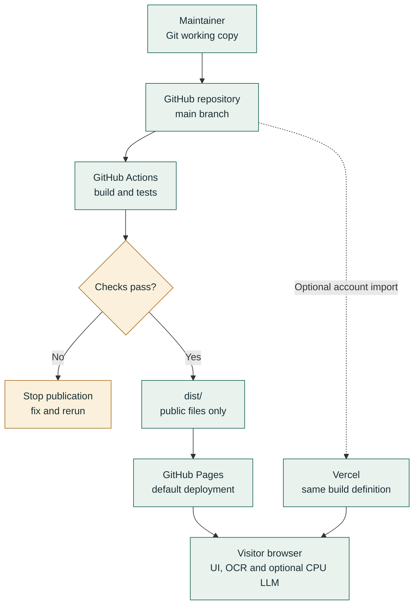

Figure 1. The maintainer pushes code; Actions validates before Pages publication. The Vercel branch is an optional separate account import, not a claim that a Vercel site is live.

[Editable Mermaid source](https://github.com/S0lluxx26/Project_web_student_support/blob/main/docs/diagrams/deployment.mmd) · [Full-size diagram](../assets/manual/diagrams/deployment.svg)

Both hosts serve static files. The visitor runs OCR and the optional LLM. Moving between hosts does not transfer inference work to a cloud server. The developer laptop does not need to remain online after publication.

### 3.2 Application data-flow graph

<!-- mermaid: data-flow -->

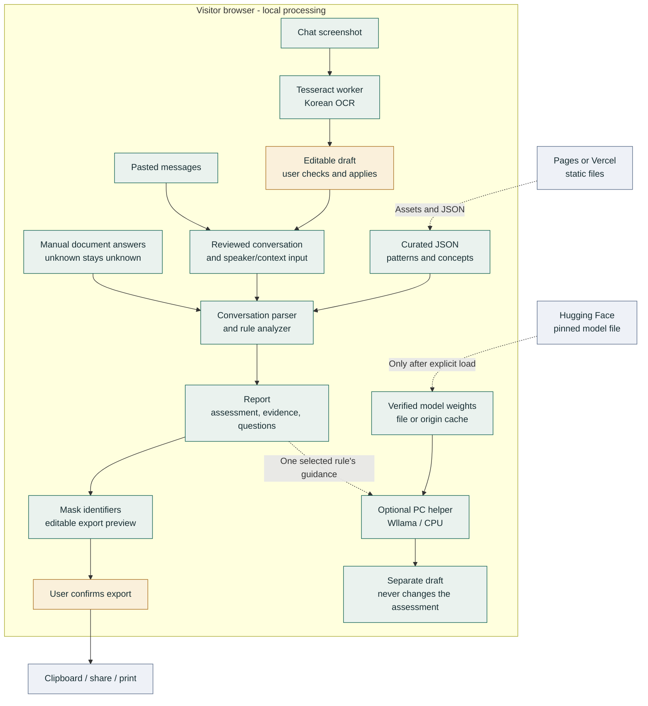

Figure 2. Local processing and external boundaries. The browser receives assets and model weights; the application does not send the user conversation or images to those sources.

[Editable Mermaid source](https://github.com/S0lluxx26/Project_web_student_support/blob/main/docs/diagrams/data-flow.mmd) · [Full-size diagram](../assets/manual/diagrams/data-flow.svg)

| Flow | Payload and destination | Control |
|---|---|---|
| Screenshot to review | Image bytes to local OCR; draft back to UI | User corrects and applies before analysis |
| Review to analyzer | Reviewed text, speaker/context input and manual answers | Unknown answers remain unknown |
| Analyzer to report | Matched rules, evidence, assessment and questions | A match is a warning signal, not proof of fraud |
| Report to helper | One selected rule guidance and fixed assessment | PC opt-in plus explicit model load |
| Model source to worker | Exact local file, verified cache or pinned download | Size/SHA-256 validation; no transcript upload |
| Report to export | Masked, editable report text | Final user confirmation is required |

Contract photos are a separate local preview; they do not enter screenshot OCR or the helper. Language preference and model caches may persist, but chat content is not intentionally stored. A model cache belongs to a site origin, so Pages and Vercel do not share it. No service worker is installed; local processing is not a promise of offline reload.

<!-- pagebreak -->

## 4. System sequence diagrams

These sequence diagrams describe the current code paths rather than a proposed backend. A worker is a browser background execution context, not a server. The cancel branches matter because an old result must not reappear after a reset.

### 4.1 Screenshot, review, analysis and export

<!-- mermaid: ocr-sequence -->

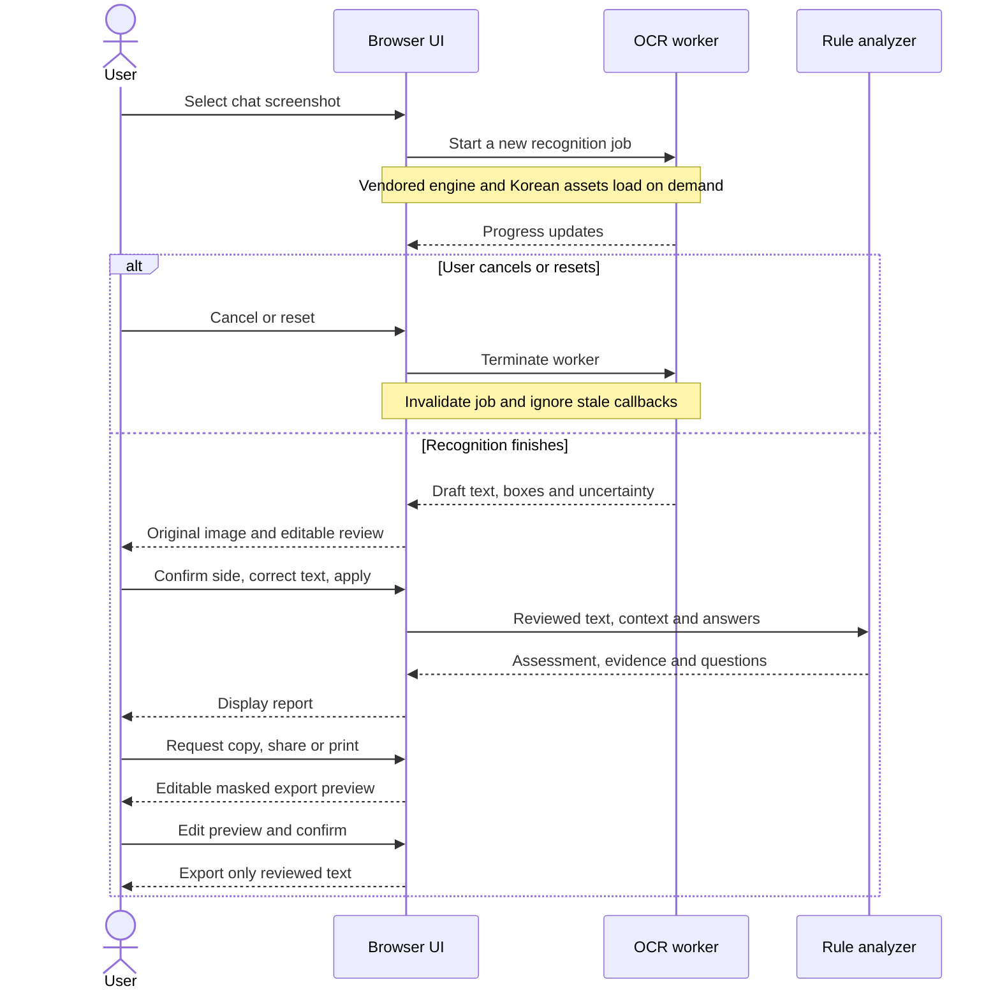

Figure 3. Recognition stops at an editable draft. The user must apply it before rules run, and must review another preview before export.

[Editable Mermaid source](https://github.com/S0lluxx26/Project_web_student_support/blob/main/docs/diagrams/ocr-sequence.mmd) · [Full-size diagram](../assets/manual/diagrams/ocr-sequence.svg)

The UI checks file bounds and cancels earlier work before beginning a new OCR job. It tracks session identity and ignores stale callbacks. Speaker-side selection does not establish whether the counterparty is an owner or agent; the result provides separate speaker review.

### 4.2 Optional desktop AI explanation

<!-- mermaid: llm-sequence -->

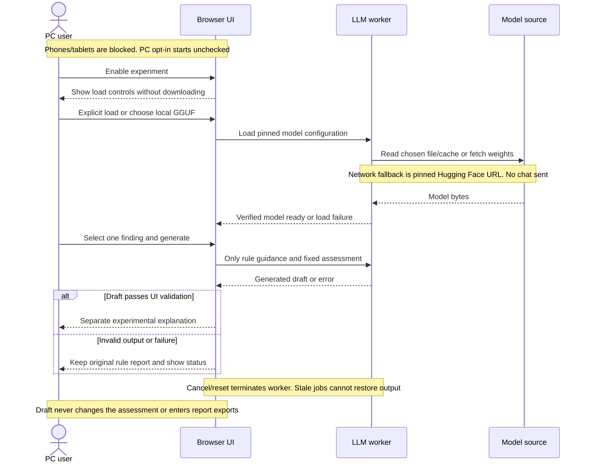

Figure 4. Model loading and explanation are explicit actions. Model source means the selected local file, the cache for this origin or the pinned Hugging Face download.

[Editable Mermaid source](https://github.com/S0lluxx26/Project_web_student_support/blob/main/docs/diagrams/llm-sequence.mmd) · [Full-size diagram](../assets/manual/diagrams/llm-sequence.svg)

The model source receives a request for weights only when downloading is necessary. A local-file choice avoids that download. The optional worker verifies the bytes and uses CPU inference. Validation can reject malformed output but cannot guarantee the meaning of an accepted draft. Cancel/reset terminates the worker and clears model state.

<!-- pagebreak -->

## 5. AI prompt sources and working method

**Primary prompt reference:** [https://github.com/S0lluxx26/Project_web_student_support/blob/main/docs/AI_PROMPTS.md](https://github.com/S0lluxx26/Project_web_student_support/blob/main/docs/AI_PROMPTS.md)

The docs/ playbook is the existing source for research and rule-authoring prompts. It covers investigating tactics, turning an investigated tactic into a rule, generating paraphrases and benign controls, finding Korean terminology and challenging a rule before release. Its opening has been updated to acknowledge OCR and the optional runtime LLM.

The report does not claim that all prompts below were copied from that playbook. Its installation and implementation templates were written for the current system. Neither file is authenticated evidence of the exact prompts used during past development.

| Purpose | Read first | Expected output and review |
|---|---|---|
| Investigate a warning tactic | docs/AI_PROMPTS.md, section 2.1 | Candidate mechanisms and ordinary comparisons; verify sources |
| Draft or challenge a rule | docs/AI_PROMPTS.md, sections 2.2 and 5 | Proposed concepts, benign controls and failure cases |
| Extend paraphrase coverage | docs/AI_PROMPTS.md, section 2.3 | Synthetic regression examples, not a real evaluation set |
| Install and run on a PC | INSTALL.md, section 1 | A running local site and actual verification results |
| Implement UI, OCR, export or AI | Suggested prompts in Chapters 6-8 and 10-12 | Reviewable code and relevant tests |
| Understand runtime model input | BROWSER_LLM_OPTIONS.md and llm.js | System prompt, structured finding guidance and output checks |

### How to use these sources with an AI assistant

1. Give the assistant the repository URL and ask it to read README.md, PLAN.md and the relevant docs/ file before editing.
2. State one bounded task, identify the files involved and describe the desired user behavior.
3. Ask for both suspicious and ordinary examples when changing detection logic.
4. Ask the assistant to identify unsupported claims instead of inventing sources, evaluation data or benchmark results.
5. Review the diff and run the relevant checks. Treat generated text as a draft until its facts and behavior are verified.

### Suggested starting prompt

```text
Read this repository and its documentation before proposing changes:
https://github.com/S0lluxx26/Project_web_student_support
Start with README.md, PLAN.md and docs/AI_PROMPTS.md.
For PC setup also follow INSTALL.md. For runtime AI behavior read
docs/BROWSER_LLM_OPTIONS.md and assets/js/llm.js.
Identify which features exist in code and which remain proposals.
Keep the rule assessment separate from the optional explanation.
Make one reviewable change, test it and report actual outcomes.
```

**Maker attribution:** Bui Xuan Mai. Keep this credit and the repository address in derivative project documentation. Do not invent personal history or research results.

<!-- pagebreak -->

## 6. Local setup and interface implementation

Install Git and Node.js 22 or later. For a complete PC setup prompt and verification checklist, see
[INSTALL.md](https://github.com/S0lluxx26/Project_web_student_support/blob/main/INSTALL.md).
From a terminal:

```sh
git clone https://github.com/S0lluxx26/Project_web_student_support.git
cd Project_web_student_support
npm ci --ignore-scripts
npx playwright install chromium
npm run build
npm run serve
```

Open http://127.0.0.1:8765/ in the browser. Double-clicking index.html does not provide the HTTP environment needed by fetch and workers.
Run npm run verify:install for the combined installation checks. Keep the
server terminal running while using the local site; Ctrl+C stops it.

For development before rebuilding, use:

```sh
npm run serve -- --src
```

### Suggested AI prompt

```text
Inspect the repository before editing. Preserve its vanilla
HTML/CSS/JavaScript architecture and Korean/English support.
Make pasted rental messages and chat screenshots the two clear
entry points. Keep documents as supporting checks.
Add a visible Demo / guide link. Use accessible labels,
keyboard focus, readable contrast and mobile layouts.
Do not add a backend or automatically load an LLM.
After changes, report the files changed and actual checks run.
```

**Implementation steps.** Keep the home page focused on the conversation. Synchronize the home and detailed text fields. On screenshot entry, reveal the conversation screen before opening its OCR panel. Invalidate an old report when input changes. Allow the navigation actions to wrap on narrow screens.

**Implemented result.** The landing page offers text and screenshot input, a Demo / guide link and supporting document/goshiwon tools. Screenshot analysis goes directly to the report after the user reviews and applies the draft.

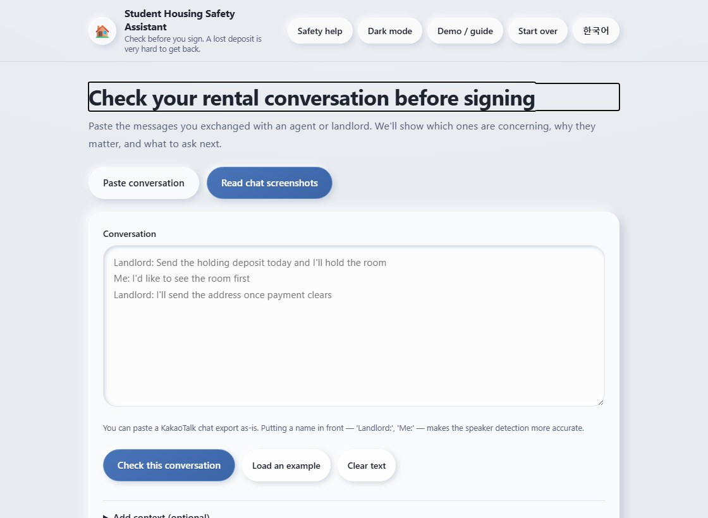

<!-- pagebreak -->

## 7. Implementing explainable conversation checks

The curated catalogue has 27 patterns. The analyzer considers text, speaker role, context and manually answered document questions. It distinguishes questions or denials from demands where supported. It displays evidence excerpts and suggested next actions.

The assessment states are strong warning signals, needs review, no known signals and insufficient information. These are project categories, not calibrated probabilities. A result with no known signal does not prove a person, listing or contract is safe.

### Suggested AI prompt

```text
Review conversation.js, analyzer.js, patterns.json and lexicon.json.
For each proposed change, give a suspicious example and an
ordinary example with similar words. Preserve unknown speakers
and distinguish questions, refusals and reported speech.
Return matched evidence and explain the next check.
Do not output a percentage chance of fraud.
Do not turn a missing document answer into a verified answer.
Validate pattern IDs, category/severity values, concept references
and bilingual keys. Identify unsupported legal claims separately.
```

**Implementation steps.** Parse messages with speaker labels; keep unrecognized roles unknown. Match curated phrases and concepts. Apply context and suppression rules. Combine manual answers without treating unknown as no. Render the assessment, evidence and questions. Add regression cases for ordinary wording as well as suspicious demands.

**Implemented result.** The release uses deterministic analysis and documented heuristics. Source-related references exist for all 27 patterns, but exact legal-claim review remains incomplete. The similarity engine in detector.js is available as a library; a review-scraping interface has not been implemented.

### Data collection decision

This workflow does not require collecting Jikbang listings or website reviews. Rental messages supplied by the user already match the central task. A listing database would introduce a separate access, maintenance and evaluation problem.

For future research, establish permitted access and usefulness first. Do not assume a site grants scraping permission. For a trained classifier, obtain consented conversations, remove identifiers, define annotation rules, use independent review and hold out a test set. Synthetic examples are useful regression fixtures but are not a substitute for a real evaluation corpus.

**Result of this step:** an explainable checker that can operate without training data, with its limits kept visible. Marketplace integration and a trained classifier remain separate future work.

<!-- pagebreak -->

## 8. Screenshot OCR and the review workflow

Use the Demo page to download fictional sample A. Its original repository file is demo/screenshots/01-kakao-pressure.jpg. The public sample is assets/manual/sample-pressure.jpg.

1. Open the checker in a new tab and choose the screenshot-reading entry point.
2. Select sample A in the file picker. Wait for the recognition progress to finish; Cancel stops a running operation.
3. Compare the original image, uncertain lines and the editable recognized text.
4. In this particular sample, select the right-hand side as your messages. For other images, inspect the layout first. The initial choice is "Don't label them".
5. Correct missing words, amounts or negations. Choose "Add and check now" only after reviewing.

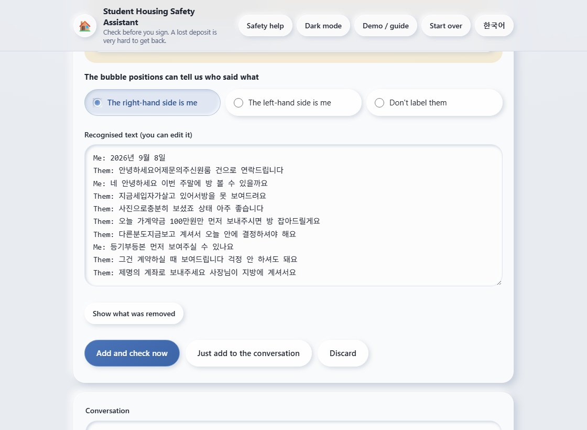

Side selection separates "Me" from "Them"; it does not prove whether the other person is an owner, agent or manager. Confirm that role separately in the report. The captured OCR draft still includes a date line and imperfect spacing. No manual text corrections were inserted into the recorded run.

### Suggested AI prompt

```text
Use the vendored Tesseract.js worker for Korean chat screenshots.
Show progress, cancel and an editable review before analysis.
Keep speaker-side selection unknown until the user chooses.
Preserve edits across language changes and navigation.
Test cancellation during startup and image encoding, not only
after recognition starts. Terminate workers and discard stale
results on reset. Use real OCR fixtures as well as mock tests.
```

**Implemented result.** Tesseract.js 5.1.1 runs locally using the vendored Korean model. The reader combines two segmentation attempts and presents a draft. It supports up to 5 images, 8 MiB per file, 25 MiB combined and 12 million decoded pixels per image. It does not upload screenshots.

**Limits.** Only Korean OCR is included. Mixed-language text, distorted captures and small fonts may fail. Real phone screenshots with consent still need evaluation. Contract photos do not use this OCR flow.

<!-- pagebreak -->

## 9. Demonstration results

The public capture record is assets/manual/cases.json. It contains fixture hashes, the recognized draft, selected side, browser version and actual matched signals. The capture script used real OCR and rule analysis without a mocked engine.

### Sample A: pressure

**Observed result:** strong_warning_signals, 4 scored signals. The chat combines pressure to send money, an agent's account request, refusal to show the room and delayed document access. Inspect the actual quoted evidence before deciding what to ask next.

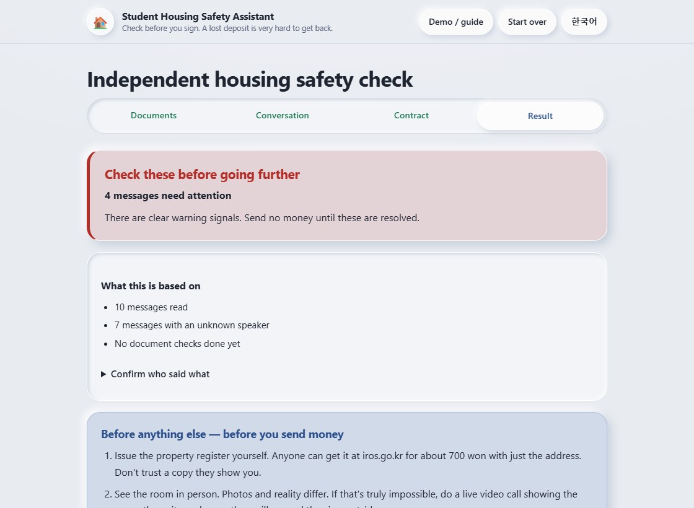

### Sample B: ordinary

Reset the session before selecting sample B so unrelated conversations do not accumulate. The original file is demo/screenshots/02-kakao-ordinary.jpg.

**Observed result:** no_known_signals, 0 scored signals. This means the current rules did not find a known signal in the supplied text. It is not a verified safe contract.

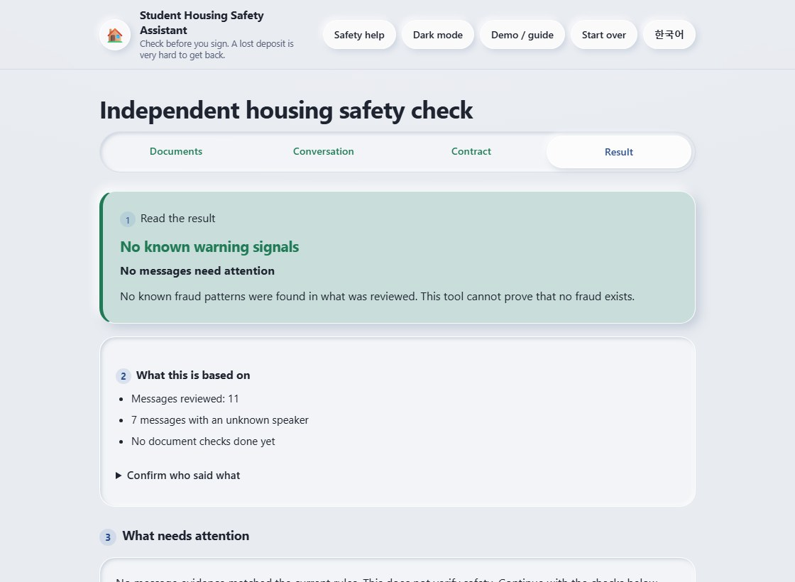

**Result of this step:** a side-by-side teaching example of differing system behavior. These two examples do not measure precision, recall or fraud detection accuracy.

<!-- pagebreak -->

## 10. Document review and private export

Open the document-check route to read the requested checks. Answer only what has actually been verified. The contract step allows local image preview beside its questions. There is no automated contract OCR, authenticity check or AI contract verdict.

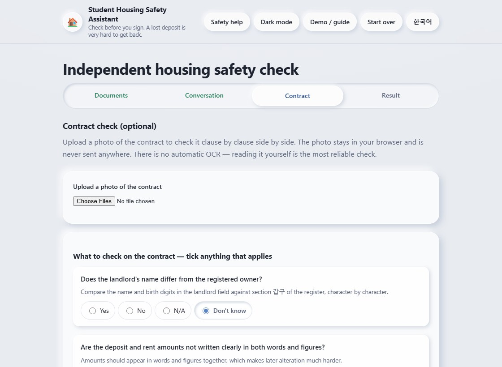

Copy, share and print open an editable preview. Automatically detected phone numbers, account-like numbers, email addresses and other supported identifiers are masked. Pattern matching can miss personal names or uncommon formats. Read and edit the preview before pressing the final action button.

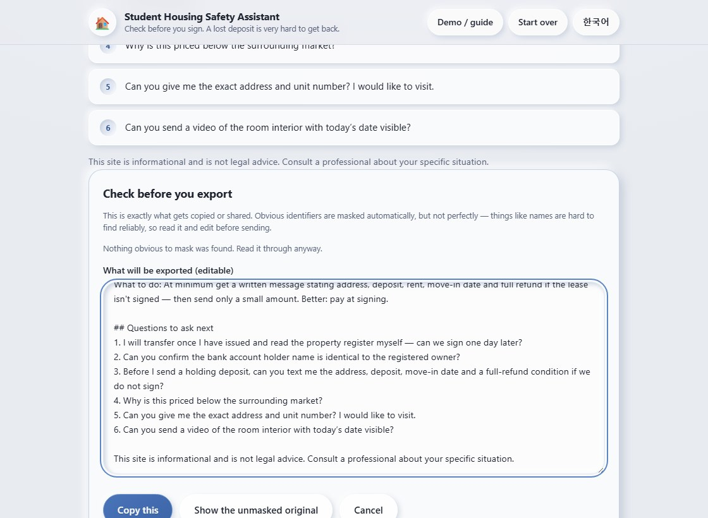

### Suggested AI prompt

```text
Preserve unknown document answers. Keep contract images local
and clearly label them as previews, with no automated verdict.
Route copy, share and print through an editable redaction preview.
Show which identifier categories were masked and retain a
deliberate restore-original control. Never claim perfect masking.
Invalidate stale export text when input changes. Verify that
direct browser printing cannot expose raw housing evidence.
```

**Implemented result.** Manual checks remain separate from OCR. Copy/share/print use the reviewed preview. Direct browser printing of the housing page asks the user to use that preview. Model drafts are excluded from report exports. Reset clears inputs, image previews, results and model state.

<!-- pagebreak -->

## 11. Optional desktop AI and its limitations

Open a report containing warnings, expand the AI explanation panel and read its limitations. On an eligible laptop or PC, enable the experiment. That checkbox alone starts no model download.

Then choose Download / load cached model, or select the exact previously downloaded GGUF file. Once ready, select one warning and generate a draft. Cancel stops work; Unload releases model memory; Remove cached model deletes this application's saved weights on the current site origin.

Phones and tablets cannot enable the helper. Detection uses browser device hints, mobile/tablet user agents and the touch-capable iPad desktop-mode signature. A narrow PC window does not disable it. This is best-effort device detection, not a guarantee of hardware performance. Text checking and OCR remain available on mobile.

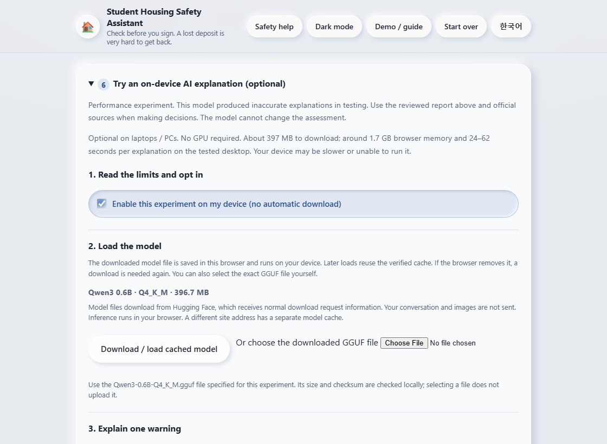

### Runtime and measured cost

- Wllama 3.6.1 runs llama.cpp through WebAssembly in a worker.
- The pinned Qwen3 0.6B Q4_K_M file is 396,705,472 bytes, approximately 397 MB.
- File size and SHA-256 are checked before use, including local files and cached copies.
- This configuration sets GPU layers to zero. A GPU is not required.
- Default Pages and Vercel deployments use one CPU thread.
- A Windows i7-14700KF desktop with roughly 32 GiB RAM took 24.27-62.02 seconds across 20 synthetic explanations; median 34.89 seconds.
- A browser process-group snapshot after loading was approximately 1.72 GB working set. This is neither a peak measurement nor exact model-only RAM.
- Other laptops may be slower or fail. These are not measurements from a typical laptop or phone.

[Wllama's browser documentation](https://github.com/ngxson/wllama) describes CPU inference and its optional GPU support. This project's selected configuration is CPU-only.

### Model boundaries and implementation prompt

The helper explains one existing rule finding. The UI does not give it raw messages, screenshots or contract photos. Its output cannot replace the rule assessment. Schema checks reject malformed output, invented finding IDs and several other invalid forms, but do not prove factual correctness.

### Suggested AI prompt

```text
Keep the rule report authoritative. Expose an optional desktop
AI panel, disabled on phones and tablets. Do not use viewport
width as the only device signal and do not require a GPU.
Show model size, measured memory/latency and quality limitations
before opt-in. Download nothing until the explicit load action.
Use the pinned model and verify its size and SHA-256.
Pass one selected rule's guidance, not the user's transcript.
Render drafts as text, keep them out of exports, and preserve
cancel/unload/cache removal. Test mobile blocking, desktop
without WebGPU, failures and reset. Do not invent benchmarks.
```

**Implemented result.** Desktop visitors can discover and opt into the experiment without a special URL. Mobile visitors receive a disabled control and an explanation. Starting OCR unloads the LLM; starting the LLM releases OCR resources. Failed generation leaves the rule report available.

### Quality evidence

The existing 20-case run accepted 19 outputs structurally. That is not 95% accuracy. Human inspection found changed conditions, contradictory wording and copied placeholders among accepted answers. One Korean request returned English and was rejected.

Real inference was also exercised on the public Pages origin: one recorded run loaded a local GGUF in 3.45 seconds, generated in 44.86 seconds and canceled another generation. These measurements confirm execution, not correct advice.

The experiment therefore remains optional and visibly cautioned. A small model can generate fluent but incorrect explanations; selecting a larger model or moving to Vercel does not establish better results.

**Evidence:** [implementation and benchmark notes](https://github.com/S0lluxx26/Project_web_student_support/blob/main/docs/BROWSER_LLM_OPTIONS.md), including the committed records in docs/benchmarks/.

**Result of this step:** a testable local explanation experiment with limits, rather than a claimed AI fraud verdict.

<!-- pagebreak -->

## 12. Demo and report reproduction

The header's Demo / guide link opens demo.html. Its Korean/English walkthrough covers samples, opening the reader, review, results, documents, export and the desktop helper. It includes downloadable fictional images and links to this Markdown guide and its PDF.

The published captures are deliberately separate from private user data. Only two existing fictional sample images are copied into public assets/manual/. Contract screenshots show the actual checklist without a real contract image. No internet contract photo is needed for this demonstration.

### Suggested AI prompt

```text
Create a bilingual Demo / guide page using the existing fictional
KakaoTalk fixtures. Capture actual application screens through
Playwright and the real OCR engine. Show both a warning case
and an ordinary case, with clear steps and limitations.
Do not fabricate screenshots or measured results. Do not use
private chat records or unlicensed contract photos.
Credit maker Bui Xuan Mai and include the repository address.
Write a detailed Markdown guide with architecture, reproducible
AI prompts, steps and observed results. Review it for factual
accuracy and attribution before converting the same text to PDF.
```

### Regenerate the materials

```sh
npm run assets:stamp
npm run demo:capture
```

Review every changed image and assets/manual/cases.json. Update this Markdown if the observed behavior or instructions changed. The English guide is the source of the PDF, and both include the full repository address.

To regenerate the PDF using the committed diagram images, install Python with reportlab, pypdf and Pillow, then run:

```sh
python scripts/build-guide-pdf.py
```

The builder reads manual/PROJECT_GUIDE.md and its relative images. It writes output/pdf/project-guide.pdf and the identical public copy at manual/project-guide.pdf. On Windows it uses Malgun Gothic for Korean glyphs; other systems must supply suitable TrueType fonts through GUIDE_FONT and GUIDE_FONT_BOLD. It does not install fonts.

**Review sequence:** read Markdown, verify commands/links/attribution, build PDF, extract its text to check completeness, render every PDF page and inspect layout. Regenerate the site artifact after the guide changes.

**Result of this step:** a public user manual and a reproducible English project guide attributed to Bui Xuan Mai.

### Regenerate Mermaid diagrams

The editable definitions are in docs/diagrams/. Mermaid is isolated in docs/report-tools/ so normal website installation does not install the renderer. Diagram generation requires Node.js 22.12 or later and the installed Playwright Chromium.

```sh
npm ci --prefix docs/report-tools --ignore-scripts
node scripts/render-report-diagrams.mjs
python scripts/build-guide-pdf.py
npm run build
npm run test:report
```

Update the diagram source and its matching Mermaid block in this Markdown together. The renderer writes SVG/PNG assets and a source/output hash manifest. The PDF builder embeds these renders; it does not fetch an online rendering service. Review every changed figure and every PDF page before publication. The PDF contents page and bookmarks are generated from the report headings.

<!-- pagebreak -->

## 13. Verification and deployment

Run the release checks before committing:

```sh
npm run assets:stamp
npm run build
npm run test:ocr
npm run test:browser
npm run test:report
```

The build runs the unit/data suites, stages only explicitly public files and verifies copied bytes. Real OCR tests use synthetic image fixtures. Browser tests exercise navigation, reset/cancellation, privacy, host URL layouts, optional LLM controls and the manual's resources. Mock LLM tests check integration behavior, not model quality.

For a model or runtime change, rerun a real benchmark separately and inspect meaning:

```sh
npm run bench:llm -- --model tmp/models/Qwen3-0.6B-Q4_K_M.gguf --cases 20
```

### GitHub and GitHub Pages

1. Review git status and git diff. Stage only intended source, documentation and public assets.
2. Commit and push to main using an authorized Git account. Keep SSH private keys outside the repository and deployment artifacts.
3. In repository Settings > Pages, use GitHub Actions as the publishing source.
4. The workflow installs locked dependencies, builds, runs real OCR/browser checks and uploads dist/ only after validation succeeds.
5. Wait for the deployment job to succeed. Open the live home page, Demo, Markdown and PDF; verify the new controls and a screenshot-to-report flow.

```sh
git status --short
git diff --stat
git add <reviewed-files>
git commit -m "Describe the verified change"
git push origin main
```

The angle-bracket value is a placeholder for reviewed paths, not a literal command argument. The repository is https://github.com/S0lluxx26/Project_web_student_support.

### Optional Vercel deployment

Import the same Git repository into Vercel. Keep the repository root as the root directory, use the Other/static framework setting and retain vercel.json. The checked-in configuration installs dependencies with npm ci, builds with node scripts/build-vercel.mjs and publishes dist/.

This provides a second static host. It does not create a server-side model or require a cloud AI key. Vercel deployment is available after an account/project is connected; no Vercel production URL is claimed here. [Vercel build configuration](https://vercel.com/docs/builds/configure-a-build)

**Result of this step:** one validated artifact can be served from a domain root or the GitHub Pages repository sub-path. The default public project link is the Pages address on this guide's cover.

<!-- pagebreak -->

## 14. Results, limitations and remaining work

### What can be demonstrated now

| Step | Observable result | Evidence |
|---|---|---|
| Interface | Text, screenshot and Demo entry points | index.html and the home capture |
| Rules | 27 curated patterns with evidence and assessment states | patterns.json and analyzer tests |
| OCR | Editable real Korean recognition before apply | capture record and real OCR tests |
| Pressure sample | 4 scored signals | cases.json and pressure-result capture |
| Ordinary sample | 0 scored signals | cases.json and ordinary-result capture |
| Documents/export | Manual checks and editable export preview | contract/export captures and browser checks |
| Optional AI | Explicit PC opt-in; mobile disabled; no GPU requirement | support policy, worker config and browser tests |
| Real model | Runs on Pages; meaning errors observed | committed model benchmark records |
| Delivery | Shared dist/ for Pages and Vercel | workflow, build script and vercel.json |
| Documentation | Maker and repository in Markdown and PDF | this guide and its generated PDF |

### Work that is still open

- Evaluate OCR on consented real phone screenshots, with human-reviewed text and speaker labels.
- Measure performance and usability on representative laptops. Test phone OCR separately; the optional LLM is disabled there.
- Review the 27 patterns' legal wording and numerical heuristics against exact current official sources with an appropriate reviewer.
- Obtain consented labeled data before attempting a trained classifier. Split by conversation/source and report false positives as well as misses.
- Connect and verify a Vercel project only if a second host is wanted.
- Conduct field research before adding a marketplace integration. No Jikbang collection or field-study results are claimed.

### Troubleshooting

**The page fails when opened from disk:** run the local HTTP server.  
**OCR is empty or wrong:** use a clearer Korean screenshot or paste corrected text; inspect amounts and negations.  
**AI control is disabled:** phone/tablet browsers are intentionally blocked; unsupported browser capabilities can also block it.  
**AI load fails:** retry the connection or use the exact GGUF file; wrong size/hash files are rejected.  
**A second host downloads again:** Pages and Vercel have different origin storage.  
**No warning appears:** inspect what was actually supplied and verified; absence of a match is not proof of safety.

<!-- pagebreak -->

## 15. References and glossary

### Primary technical references

- [Project repository](https://github.com/S0lluxx26/Project_web_student_support)
- [GitHub Pages: static hosting](https://docs.github.com/en/pages/getting-started-with-github-pages/what-is-github-pages)
- [Vercel: configuring a build](https://vercel.com/docs/builds/configure-a-build)
- [Tesseract.js documentation and source](https://github.com/naptha/tesseract.js)
- [Wllama: browser llama.cpp bindings](https://github.com/ngxson/wllama)
- [Pinned model repository](https://huggingface.co/unsloth/Qwen3-0.6B-GGUF/tree/50968a4468ef4233ed78cd7c3de230dd1d61a56b)
- [Project OCR notes](https://github.com/S0lluxx26/Project_web_student_support/blob/main/docs/OCR.md)
- [Project model measurements](https://github.com/S0lluxx26/Project_web_student_support/blob/main/docs/BROWSER_LLM_OPTIONS.md)
- [Current project plan](https://github.com/S0lluxx26/Project_web_student_support/blob/main/PLAN.md)

Implementation and capture review date: 12 September 2026. External documentation can change; pinned project files and recorded measurements describe this edition.

### Prompt and installation documentation

- [AI Prompt Playbook: docs/AI_PROMPTS.md](https://github.com/S0lluxx26/Project_web_student_support/blob/main/docs/AI_PROMPTS.md)
- [PC installation and its AI setup prompt: INSTALL.md](https://github.com/S0lluxx26/Project_web_student_support/blob/main/INSTALL.md)
- [Mermaid data-flow syntax](https://mermaid.js.org/syntax/flowchart.html)
- [Mermaid sequence diagram syntax](https://mermaid.js.org/syntax/sequenceDiagram.html)
- [Editable project diagrams](https://github.com/S0lluxx26/Project_web_student_support/tree/main/docs/diagrams)

### Short glossary

| Term | Meaning in this project |
|---|---|
| OCR | Extracting editable text from an image |
| Rule analyzer | Curated phrase/concept logic producing warning signals |
| LLM | A language model generating an experimental explanation |
| Worker | Browser background execution, separate from the interface thread |
| WASM | WebAssembly code running on the visitor device |
| OPFS | Origin-private browser file storage used for model cache |
| GGUF | The model weight file format selected for Wllama |
| CI | Automated checks run by GitHub Actions before publication |
| dist/ | Generated public site artifact, not the full repository |

**Traceability.** Baseline code reviewed for this report: commit 67c2dd4. The report update adds documentation, diagrams and generation checks. Diagrams reflect the existing application behavior; they do not represent newly added backend services.
