# 학생 주거 안전 도우미
## 프로젝트 기술 보고서 및 화면 사용 설명서

**제작자: Bui Xuan Mai**

판본: 2026년 9월 12일 · 한국어판 · 대화 분석 로직 검토 및 학습 예시 반영

**GitHub 저장소:** [https://github.com/S0lluxx26/Project_web_student_support](https://github.com/S0lluxx26/Project_web_student_support)

**운영 웹사이트:** [https://s0lluxx26.github.io/Project_web_student_support/](https://s0lluxx26.github.io/Project_web_student_support/)

**데모 및 사용법:** [https://s0lluxx26.github.io/Project_web_student_support/demo.html](https://s0lluxx26.github.io/Project_web_student_support/demo.html)

**판단 도움말 및 연습:** [https://s0lluxx26.github.io/Project_web_student_support/help.html](https://s0lluxx26.github.io/Project_web_student_support/help.html)

**AI 프롬프트 참고 문서:** [docs/AI_PROMPTS.md](https://github.com/S0lluxx26/Project_web_student_support/blob/main/docs/AI_PROMPTS.md)

이 보고서는 프로젝트의 목적, 저장소 구조, 브라우저 안에서의 데이터 흐름, 구현 과정, 실행 및 배포 방법을 설명한다. 시스템 구조와 실제 화면 사용법을 함께 제시하고, AI에 작업을 요청할 때 사용할 수 있는 프롬프트와 단계별 검증 결과를 정리했다.

핵심 평가는 검토된 규칙으로 수행한다. OCR은 한국어 대화 스크린샷을 글로 변환하고, 선택형 소형 LLM은 PC에서 이미 발견된 경고 하나를 설명한다. 세 구성 요소의 역할과 한계는 서로 다르다.

수록된 대화 예시는 모두 가상 자료이며, 앱 화면은 실제 실행 화면을 캡처한 것이다. 합성 예시의 통과 결과를 실제 사기 탐지 정확도로 해석해서는 안 된다. 이 문서는 구현된 기능과 실제 데이터, 분야별 검토 또는 외부 계정 연결이 필요한 작업을 구분한다. 한국어판은 영문 보고서의 15개 장을 바탕으로 작성했으며, 다이어그램과 화면 캡처도 한국어로 제공한다.

<!-- pagebreak -->

## 목차

PDF 목차에는 페이지 번호와 이동 링크가 표시된다. Markdown에서는 아래 링크로 해당 장으로 이동할 수 있다.

<!-- toc:start -->

- [1. 프로젝트 개요와 범위](#1-프로젝트-개요와-범위)
- [2. 저장소 아키텍처와 파일 구조](#2-저장소-아키텍처와-파일-구조)
- [3. 배포 구조와 데이터 흐름](#3-배포-구조와-데이터-흐름)
- [4. 시스템 시퀀스 다이어그램](#4-시스템-시퀀스-다이어그램)
- [5. AI 프롬프트 출처와 작업 방법](#5-ai-프롬프트-출처와-작업-방법)
- [6. 로컬 설치와 화면 구현](#6-로컬-설치와-화면-구현)
- [7. 근거를 제시하는 대화 분석 구현](#7-근거를-제시하는-대화-분석-구현)
- [8. 스크린샷 OCR과 검토 절차](#8-스크린샷-ocr과-검토-절차)
- [9. 시연 결과와 학습 예시](#9-시연-결과와-학습-예시)
- [10. 문서 확인과 개인정보를 고려한 내보내기](#10-문서-확인과-개인정보를-고려한-내보내기)
- [11. 선택형 PC AI와 한계](#11-선택형-pc-ai와-한계)
- [12. 데모와 보고서 재현 방법](#12-데모와-보고서-재현-방법)
- [13. 검증과 배포](#13-검증과-배포)
- [14. 성과와 한계 및 남은 과제](#14-성과와-한계-및-남은-과제)
- [15. 참고 자료와 용어](#15-참고-자료와-용어)

<!-- toc:end -->

**그림 목록:** 저장소에서 배포까지의 흐름, 애플리케이션 데이터 흐름, 스크린샷 인식 및 내보내기 시퀀스, 선택형 PC AI 시퀀스. 각 그림 옆에 편집 가능한 Mermaid 원본과 전체 크기 그림 링크가 있다.

<!-- pagebreak -->

## 1. 프로젝트 개요와 범위

이 프로젝트는 한국에서 주거 계약을 준비하는 학생이 임대 관련 대화를 검토하도록 돕는다. 알려진 위험 신호와 해당 문장을 보여 주고, 다음에 확인할 사항을 제안한다. 특정 인물이나 주택이 사기라고 판정하는 도구는 아니다.

### 주요 사용자와 사용 목적

- 학생이 임대인 또는 중개인과의 대화를 붙여 넣고 결과를 검토한다.
- 한국어 대화 스크린샷을 선택하고, OCR 초안과 화자를 수정한 뒤 분석한다.
- 실제 확인한 서류 내용을 입력하고, 결과를 복사하거나 공유하기 전에 미리보기를 검토한다.
- PC 사용자는 원하는 경우 이미 발견된 경고 하나에 대한 기기 내 AI 설명 실험을 실행한다.

### 구현 범위와 확인 기준

| 요구 사항 | 구현된 동작 | 적용 한계 |
|---|---|---|
| 정적 배포 | 동일한 빌드로 GitHub Pages와 Vercel 지원 | Vercel 계정 연결은 선택 사항이며 미완료 |
| 모바일 이용 | 글 분석, OCR, 사용 설명서 제공 | 선택형 LLM은 휴대전화와 태블릿에서 비활성화 |
| 입력의 기기 내 처리 | 메시지와 이미지를 브라우저 안에서 처리 | 호스팅 서버에는 일반 파일 요청 정보가 전달됨 |
| 근거를 보여 주는 결과 | 27개 패턴과 해당 근거 표시 | 경험적 규칙이며 보정된 사기 확률이 아님 |
| AI 설명 보조 | PC에서 명시적으로 선택한 후 CPU로 실행 | 약 397 MB 다운로드, 의미 오류 관찰 |
| 재현 가능한 시연 | 기존 2개 예시와 추가 연습 스크린샷 12개 | 실제 환경에서의 정확도 평가가 아님 |

**기술의 구분:** 규칙 분석기가 평가를 만들고, Tesseract가 스크린샷을 인식하며, Wllama가 선택형 Qwen 모델을 실행한다. 학습된 임대 사기 분류기, 앱 데이터베이스, 수집용 스크레이퍼, 서버 측 추론 API는 없다.

계약서 사진은 기기 내 미리보기로만 사용하며 대화 OCR이나 AI 도우미에 입력하지 않는다. 언어와 화면 테마 설정, 모델 캐시는 남을 수 있지만 대화 내용을 의도적으로 저장하지 않는다. 모델 캐시는 사이트 출처(origin)에 속하므로 다른 호스트에서 공유되지 않는다. 서비스 워커가 없어 기기 내 처리만으로 오프라인 재접속을 보장할 수는 없다.

**권장 읽기 순서:** 설계 검토는 2-5장, 개발은 6-8장과 11-13장, 실제 사용은 8-10장과 웹 데모를 참고한다. 검증 근거와 남은 과제는 14장에 정리했다.

<!-- pagebreak -->

## 2. 저장소 아키텍처와 파일 구조

저장소에는 기본 HTML/CSS/JavaScript 앱, 검토된 JSON 데이터, 저장소에 포함된 브라우저 실행 라이브러리, 문서, 테스트 및 빌드 스크립트가 있다. 운영 시 별도의 서버 프로그램을 실행할 필요가 없다.

### 주요 파일 구조

아래는 이해와 재현에 필요한 주요 경로이다. 모든 과거 문서와 테스트를 나열한 목록은 아니며, 생성되는 폴더는 별도로 표시했다. 파일 이름과 명령은 실제 경로와 일치하도록 원문을 유지한다.

```text
Project_web_student_support/
|-- index.html                    # 메인 앱
|-- demo.html                     # 한국어/영어 화면 사용법
|-- help.html                     # 판단 도움말과 예시 12개
|-- INSTALL.md                    # PC 설치 및 AI 설치 프롬프트
|-- README.md / PLAN.md            # 개요와 현재 계획
|-- package.json / package-lock.json
|-- vercel.json / .vercelignore    # 선택형 Vercel 설정
|-- .github/workflows/deploy.yml   # 검사 및 Pages 배포
|-- assets/
|   |-- css/                      # 공통 및 설명서 스타일
|   |-- js/
|   |   |-- app.js / i18n.js       # 시작, 화면 이동, 언어
|   |   |-- housing.js            # 대화 화면과 세션 상태
|   |   |-- conversation.js       # 메시지와 화자 해석
|   |   |-- analyzer.js           # 규칙 분석과 근거
|   |   |-- detector.js           # 개념 매칭, 유사도 API
|   |   |-- ocr.js / redact.js    # OCR과 개인정보 가림
|   |   |-- llm.js / llm-ui.js / llm-worker.js
|   |   |-- goshiwon.js / manual.js
|   |   |-- theme.js / help.js     # 테마와 학습 페이지
|   |-- vendor/                   # 고정된 OCR 및 LLM 라이브러리
|   |-- examples/                 # PNG 12개, 목표와 OCR 관찰 기록
|   |-- manual/
|       |-- cases.json            # 기존 영문 화면의 인식 기록
|       |-- ko/                   # 한국어 화면 캡처 및 cases.json
|       |-- diagrams/             # 생성된 영문 그림과 검증 정보
|           |-- ko/               # 생성된 한국어 그림과 검증 정보
|-- data/                         # 패턴, 개념, 문서, 예시, 번역
|-- docs/
|   |-- AI_PROMPTS.md             # 조사 및 규칙 작성 프롬프트
|   |-- OCR.md / BROWSER_LLM_OPTIONS.md
|   |-- DEPLOY_VERCEL.md / IMPLEMENTATION_STATUS.md
|   |-- REVIEW_2026-09-12.md       # 로직 및 학습 예시 검토
|   |-- FIELD_RESEARCH.md / REVIEW_ANALYSIS.md
|   |-- SCAM_PATTERNS.md / CONTRIBUTING.md
|   |-- benchmarks/              # 실제 모델 측정 기록
|   |-- diagrams/ko/             # 한국어 Mermaid 원본
|   |-- report-tools/            # 문서 전용 Mermaid 의존성
|-- manual/
|   |-- PROJECT_GUIDE.md / project-guide.pdf
|   |-- PROJECT_GUIDE_KO.md       # 이 한국어 보고서의 원본
|   |-- project-guide-ko.pdf      # 공개 한국어 PDF
|-- demo/                        # 기존 가상 대화 자료 22개
|-- scripts/
|   |-- capture-manual.mjs / render-report-diagrams.mjs
|   |-- build-guide-pdf.py / check-report.mjs
|-- dist/                        # 공개 사이트 빌드 결과, Git 제외
|-- output/pdf/                  # PDF 산출물, Git 제외
|-- tmp/                         # 임시 작업과 기록, Git 제외
```

### 모듈별 역할

| 구성 요소 | 주요 파일 | 책임 |
|---|---|---|
| 화면과 이동 | index.html, style.css, app.js | 홈, 단계 이동, 언어, 로딩과 복구 |
| 데이터 | patterns.json, lexicon.json, documents.json, i18n.json | 27개 패턴, 개념 규칙, 질문과 양언어 문구 |
| 대화 분석 | conversation.js, analyzer.js, housing.js | 화자, 요구와 질문, 근거와 평가 |
| 스크린샷 읽기 | ocr.js, assets/vendor/tesseract/ | 한국어 인식, 진행 상태, 편집 검토 |
| 내보내기 | redact.js, housing.js | 복사, 공유, 인쇄 전 개인정보 가림과 검토 |
| 선택형 설명 | llm.js, llm-ui.js, llm-worker.js | PC 사용 동의, 모델 검증, 워커와 출력 검사 |
| 데모와 문서 | demo.html, assets/manual/, manual/ | 가상 예시, 실제 화면, 보고서 다운로드 |
| 도움말과 테마 | help.html, help.js, theme.js, assets/examples/ | 독립적인 확인 방법, 예시와 화면 설정 |
| 빌드와 배포 | scripts/build-vercel.mjs, deploy.yml, vercel.json | GitHub Pages와 선택형 Vercel용 공통 산출물 |

다른 경로가 표시되지 않은 JavaScript 파일은 assets/js/ 아래에 있다. 배포 워크플로는 .github/workflows/deploy.yml이다.

**연동 상태:** analyzer.js는 Conversation.parse()와 Detector.matchRules()를 호출한다. 중복·유사 문장 검색용 Detector.scan()은 앱에서 호출하지 않는 라이브러리 API이다. 구현된 리뷰 분석 기능으로 소개하면 안 된다.

**저장소와 공개 파일:** scripts/build-vercel.mjs는 허용 목록을 사용해 HTML 페이지 3개, 영문·한국어 보고서, assets/, JSON 및 라이선스를 dist/에 넣는다. docs/와 scripts/ 전체, 원본 테스트 폴더, node_modules, GGUF 모델, 비밀 키는 사이트에 배포하지 않는다. assets/manual/과 assets/examples/ 아래의 선택된 가상 자료, 화면 캡처, 관찰 기록만 공개한다. Mermaid 렌더러는 문서용 의존성으로 분리되어 일반 설치에 포함되지 않는다.

<!-- pagebreak -->

## 3. 배포 구조와 데이터 흐름

다음 그림은 저장소의 Mermaid 원본으로 생성한다. 실선은 주요 처리 흐름, 점선은 보조 입력이나 선택 동작이다. 사용자가 직접 검토하는 단계도 표시했다.

### 3.1 저장소에서 배포까지

<!-- mermaid: deployment -->

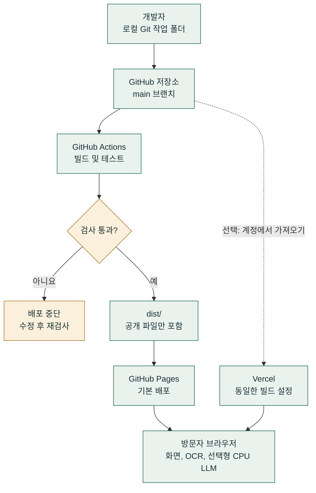

그림 1. GitHub Actions 검사를 통과한 뒤 GitHub Pages에 배포한다. Vercel은 계정을 따로 연결하는 선택 경로이다. 설정 파일은 있지만 실제 Vercel 사이트가 운영 중이라고 주장하지 않는다.

[Mermaid 원본](https://github.com/S0lluxx26/Project_web_student_support/blob/main/docs/diagrams/ko/deployment.mmd) · [전체 크기 그림](../assets/manual/diagrams/ko/deployment.svg)

두 호스트 모두 정적 파일을 제공한다. OCR과 선택형 LLM은 방문자 기기에서 실행한다. 호스트를 바꿔도 연산이 클라우드 서버로 이전되지 않는다. 배포 후 개발자의 PC를 계속 켜 둘 필요는 없다.

### 3.2 애플리케이션 데이터 흐름

<!-- mermaid: data-flow -->

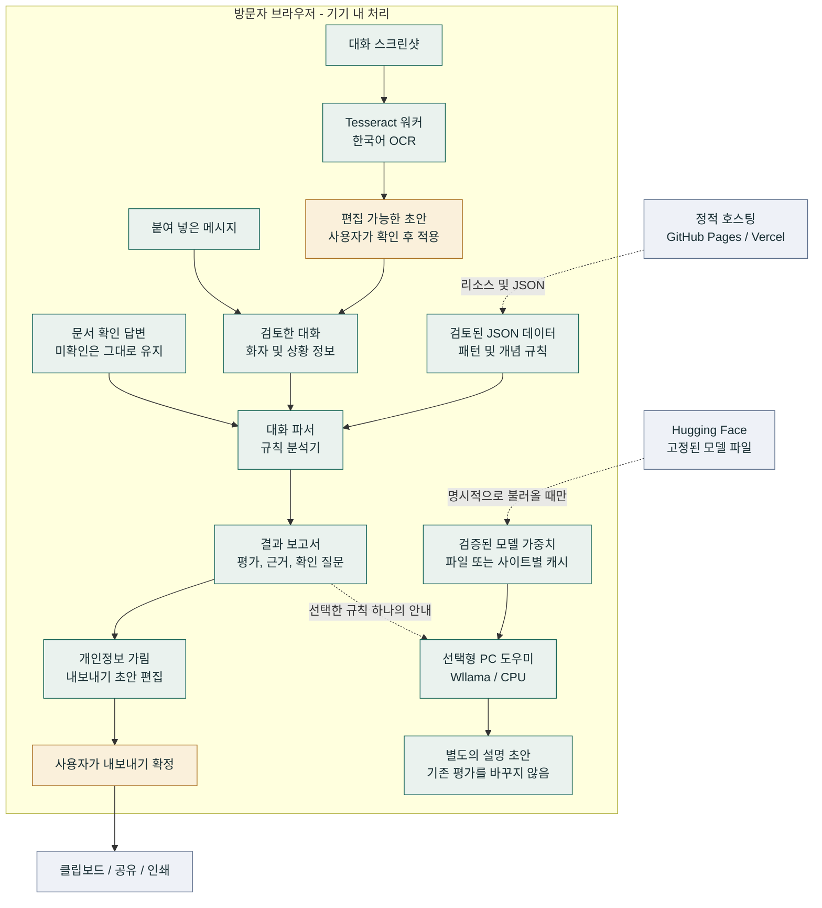

그림 2. 기기 내 처리와 외부 서비스의 경계. 브라우저는 사이트 리소스와 모델 파일을 받지만, 앱은 사용자의 대화나 이미지를 해당 서버에 보내지 않는다.

[Mermaid 원본](https://github.com/S0lluxx26/Project_web_student_support/blob/main/docs/diagrams/ko/data-flow.mmd) · [전체 크기 그림](../assets/manual/diagrams/ko/data-flow.svg)

| 흐름 | 전달하는 내용과 위치 | 확인 장치 |
|---|---|---|
| 스크린샷에서 검토 화면 | 이미지 바이트를 기기 내 OCR에 전달하고 초안을 표시 | 사용자가 수정하고 적용해야 분석 시작 |
| 검토 화면에서 분석기 | 검토한 글, 화자, 상황 및 문서 답변 | 미확인 답변을 확인된 것으로 처리하지 않음 |
| 분석기에서 보고서 | 일치 규칙, 근거, 평가와 질문 | 규칙 일치는 위험 신호이며 사기의 증거가 아님 |
| 보고서에서 AI | 선택한 규칙 하나의 안내와 기존 평가 | PC에서 사용 선택 후 모델을 명시적으로 불러옴 |
| 모델 공급원에서 워커 | 지정된 로컬 파일, 검증된 캐시 또는 고정 다운로드 | 파일 크기와 SHA-256 검사, 대화 전송 없음 |
| 보고서에서 내보내기 | 개인정보를 가리고 편집할 수 있는 결과 글 | 사용자의 최종 확인 필요 |

<!-- pagebreak -->

## 4. 시스템 시퀀스 다이어그램

이 그림은 현재 코드의 실행 순서를 나타낸다. 워커는 브라우저의 백그라운드 실행 공간이다. 초기화한 뒤 이전 작업의 결과가 다시 나타나지 않도록 중단과 상태 무효화 경로를 포함한다.

### 4.1 스크린샷 검토와 분석 및 내보내기

<!-- mermaid: ocr-sequence -->

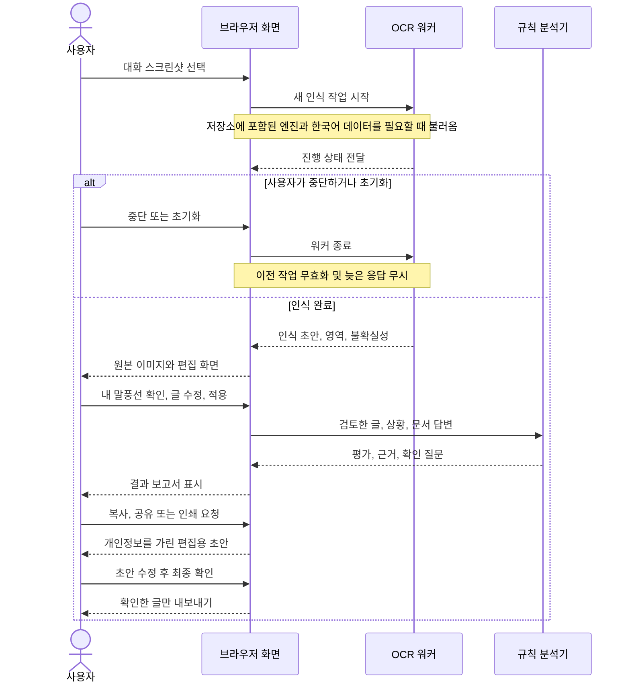

그림 3. OCR은 편집 가능한 초안에서 멈춘다. 사용자가 초안을 적용해야 규칙 분석이 시작되며, 내보내기 전에는 개인정보를 가린 미리보기를 다시 검토한다.

[Mermaid 원본](https://github.com/S0lluxx26/Project_web_student_support/blob/main/docs/diagrams/ko/ocr-sequence.mmd) · [전체 크기 그림](../assets/manual/diagrams/ko/ocr-sequence.svg)

앱은 파일 제한을 검사하고 세션 식별자로 초기화 이전의 응답을 무시한다. 말풍선 방향은 내 메시지를 구분할 뿐이므로, 상대가 소유자나 중개인인지는 별도로 확인한다.

### 4.2 선택형 PC AI 설명

<!-- mermaid: llm-sequence -->

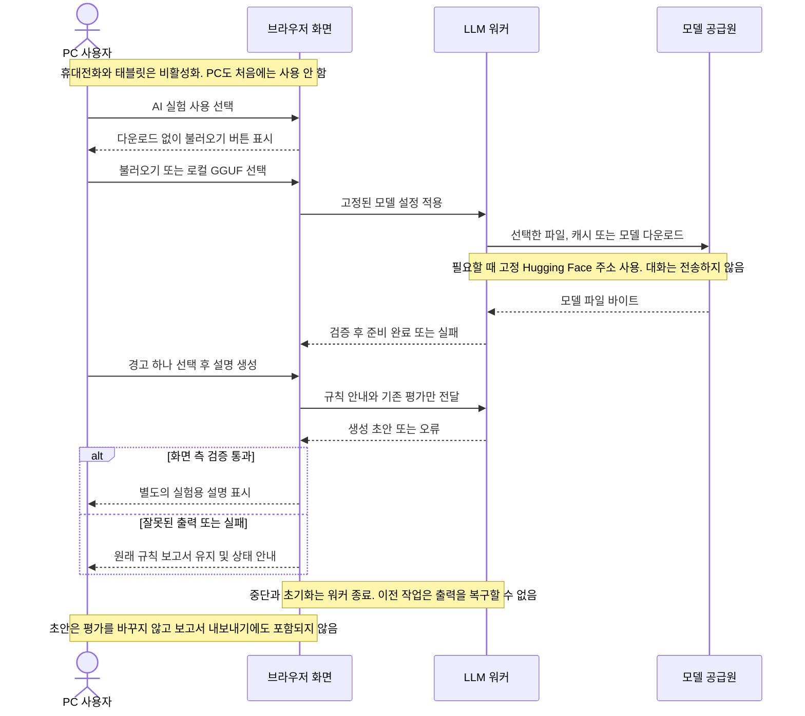

그림 4. 모델 불러오기와 설명 생성은 각각 명시적인 사용자 동작이다. 모델 공급원은 선택한 로컬 파일, 현재 사이트의 캐시 또는 고정된 Hugging Face 다운로드이다.

[Mermaid 원본](https://github.com/S0lluxx26/Project_web_student_support/blob/main/docs/diagrams/ko/llm-sequence.mmd) · [전체 크기 그림](../assets/manual/diagrams/ko/llm-sequence.svg)

다운로드가 필요할 때만 모델 서버에 파일 요청을 보낸다. 로컬 파일을 선택하면 그 다운로드를 피할 수 있다. 워커는 바이트를 검증하고 CPU로 추론한다. 출력 검사는 형식 오류를 거절할 수 있지만 통과한 문장의 의미까지 보장하지는 않는다. 중단과 초기화는 워커를 종료하고 모델 상태를 정리한다.

<!-- pagebreak -->

## 5. AI 프롬프트 출처와 작업 방법

**주요 참고 문서:** [docs/AI_PROMPTS.md](https://github.com/S0lluxx26/Project_web_student_support/blob/main/docs/AI_PROMPTS.md)

문서 주소: https://github.com/S0lluxx26/Project_web_student_support/blob/main/docs/AI_PROMPTS.md

docs/의 프롬프트 문서는 위험 수법 조사, 규칙과 대조 예시 작성, 재표현 확장, 기존 규칙 검토의 출발점이다. 첫 부분은 OCR과 선택형 LLM이 추가되었음을 반영하도록 갱신되어 있다.

아래 프롬프트가 모두 그 문서에서 그대로 인용된 것은 아니다. 이 보고서의 설치·구현 프롬프트는 현재 시스템을 설명하기 위한 권장 템플릿이며 한국어로 제공한다. 과거 개발 중 실제로 입력한 프롬프트 전체를 증명하는 대화 기록은 아니다.

| 목적 | 먼저 읽을 자료 | 기대 산출물과 검토 |
|---|---|---|
| 위험 수법 조사 | docs/AI_PROMPTS.md 2.1절 | 작동 원리 후보와 일반 대화 비교, 출처 확인 |
| 규칙 작성·반박 | 같은 문서 2.2절과 5절 | 개념 후보, 정상 대조군, 실패 예시 |
| 다른 표현 추가 | 같은 문서 2.3절 | 합성 회귀 테스트 예시, 실제 평가 데이터와 구분 |
| PC 설치와 실행 | INSTALL.md 1절 | 실행되는 로컬 사이트와 실제 검사 결과 |
| 화면, OCR, 내보내기, AI 구현 | 이 보고서 6-8장과 10-12장 | 검토 가능한 변경과 관련 테스트 |
| 실행 시 모델 입력 이해 | BROWSER_LLM_OPTIONS.md, llm.js | 시스템 프롬프트, 구조화된 규칙 안내와 출력 검사 |

### AI와 함께 작업하는 순서

1. 저장소 주소를 전달하고 README.md, PLAN.md와 관련 docs/ 문서를 먼저 읽게 한다.
2. 한 번에 처리할 범위를 정하고 대상 파일과 기대하는 사용자 동작을 설명한다.
3. 탐지 로직을 바꿀 때는 의심 사례와 비슷한 단어를 쓰는 일반 사례를 함께 요청한다.
4. 출처, 평가 데이터, 측정값을 만들어 내지 말고 근거가 부족한 주장을 표시하도록 한다.
5. 변경 사항을 검토하고 관련 검사를 실행한다. 생성된 설명은 사실과 동작을 확인할 때까지 초안으로 취급한다.

### 시작용 권장 프롬프트

```text
수정을 제안하기 전에 다음 저장소와 문서를 읽어 주세요.
https://github.com/S0lluxx26/Project_web_student_support
README.md, PLAN.md, docs/AI_PROMPTS.md부터 확인하세요.
PC 설치는 INSTALL.md를 따르고, 실행 중 AI 동작은
docs/BROWSER_LLM_OPTIONS.md와 assets/js/llm.js를 읽으세요.
코드에 있는 기능과 아직 제안 단계인 기능을 구분하세요.
규칙 평가와 선택형 AI 설명을 분리해 유지하세요.
검토 가능한 범위로 변경하고 테스트한 실제 결과를 보고하세요.
```

**제작자 표기:** Bui Xuan Mai. 프로젝트를 바탕으로 만든 문서에도 제작자와 저장소 주소를 유지한다. 개인 이력이나 수행하지 않은 연구 결과를 추가하지 않는다.

<!-- pagebreak -->

## 6. 로컬 설치와 화면 구현

Git과 Node.js 22 이상을 설치한다. 자세한 PC 설치 프롬프트와 확인 목록은 [INSTALL.md](https://github.com/S0lluxx26/Project_web_student_support/blob/main/INSTALL.md)를 따른다.

```sh
git clone https://github.com/S0lluxx26/Project_web_student_support.git
cd Project_web_student_support
npm ci --ignore-scripts
npx playwright install chromium
npm run build
npm run serve
```

브라우저에서 http://127.0.0.1:8765/ 를 연다. index.html을 더블클릭하면 fetch와 워커에 필요한 HTTP 환경이 제공되지 않는다. 로컬 사이트를 쓰는 동안 터미널을 열어 두고, 종료하려면 Ctrl+C를 누른다.

전체 설치 검사는 npm run verify:install로 실행한다. 포트가 이미 사용 중이면 npm run serve -- --port 9000으로 바꾸고 http://127.0.0.1:9000/ 에 접속한다. 빌드 전 소스를 바로 확인하려면 다음을 사용한다.

```sh
npm run serve -- --src
```

이미 저장소가 있는 PC에서는 먼저 git status로 수정 내용을 확인한다. 필요한 변경을 저장하거나 커밋한 뒤 git pull --ff-only로 동기화한다. 이후 의존성과 검사를 갱신한다. 설치만 하는 경우 화면, 예시, PDF를 다시 생성할 필요는 없다.

### 화면 구현 권장 프롬프트

```text
저장소를 확인하고 기본 HTML/CSS/JavaScript 구조와
한국어·영어 지원을 유지하세요. 대화 붙여넣기와 스크린샷 읽기를
주요 시작 동작으로 두고, 서류 확인은 보조 기능으로 배치하세요.
데모와 사용법 링크를 쉽게 찾게 하세요. 입력 이름, 키보드 초점,
글자 대비와 모바일 줄바꿈을 확인하세요.
백엔드를 추가하거나 LLM을 자동으로 불러오지 마세요.
수정한 파일과 실제로 실행한 검사를 보고하세요.
```

**구현 과정:** 홈 화면의 대화 입력과 상세 화면 입력을 동기화한다. 스크린샷 진입 시 대화 화면을 먼저 표시한 뒤 OCR 패널을 연다. 입력이 바뀌면 이전 결과를 무효화하고, 좁은 화면에서는 탐색 버튼이 줄바꿈되도록 한다.

**구현 결과:** 첫 화면에서 글 분석과 스크린샷 읽기를 시작할 수 있고, 데모 및 서류·고시원 보조 기능에 접근할 수 있다. OCR 초안을 검토해 적용하면 바로 결과 화면으로 이동한다.

결과는 1 요약, 2 입력 범위, 3 근거, 4 다음 확인 사항, 5 검토 후 내보내기, 6 선택형 AI 순서로 읽는다. 근거 강조와 행동 안내 색상으로 중요한 부분을 찾기 쉽게 했다. 헤더의 판단 도움말과 어두운 화면 버튼을 이용할 수 있다. 테마는 홈, 데모, 도움말에 유지되며 대화는 저장하지 않는다.

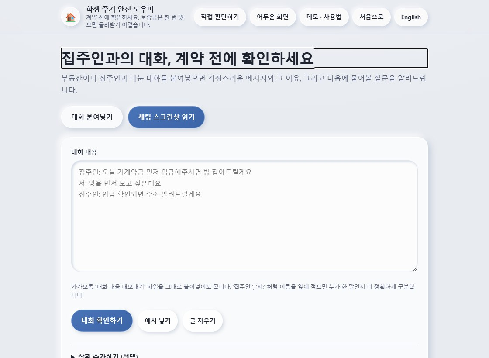

<!-- pagebreak -->

## 7. 근거를 제시하는 대화 분석 구현

현재 목록에는 27개 패턴이 있다. 분석기는 글, 화자 역할, 문맥과 사용자가 직접 답한 문서 확인 항목을 함께 본다. 지원되는 표현에서는 질문·거절·부인과 요구를 구분하고, 해당 문장과 다음 확인 행동을 표시한다.

평가 상태는 뚜렷한 위험 신호, 확인 필요, 알려진 위험 신호 없음, 정보 부족이다. 이는 프로젝트에서 정한 분류이며 보정된 확률이 아니다. 알려진 신호가 없다는 결과가 사람, 매물 또는 계약의 안전을 보증하지 않는다.

### 분석 구현 권장 프롬프트

```text
conversation.js, analyzer.js, patterns.json, lexicon.json을 검토하세요.
각 변경에 의심 사례와 비슷한 단어를 쓰는 일반 사례를 붙이세요.
모르는 화자는 미확인 상태로 두고, 질문·거절·전달한 말을 구분하세요.
일치한 근거와 다음 확인 사항을 보여 주세요.
사기 확률을 백분율로 만들거나 미확인 서류를 확인된 것으로 바꾸지 마세요.
패턴 ID, 심각도와 범주, 개념 참조, 양언어 키를 검사하세요.
근거가 부족한 법률 주장은 별도로 표시하세요.
```

**구현 과정:** 화자 표식으로 메시지를 나누되 알아보지 못한 역할은 미확인으로 둔다. 문구와 개념을 매칭한 뒤 문맥과 억제 규칙을 적용한다. 미확인 답변을 '아니요'로 바꾸지 않고 문서 답변을 합친다. 평가, 근거, 질문을 표시하며 일반 표현도 회귀 테스트에 포함한다.

**구현 결과:** 규칙과 문서화된 경험적 기준으로 일관된 결과를 만든다. 27개 패턴에 관련 출처가 있지만 각 법률 주장에 대한 정밀 검토는 아직 끝나지 않았다. detector.js의 유사도 API는 존재하지만 웹 리뷰 수집·분석 화면은 없다.

### 이번 판본의 로직 검토

문장의 소속 화자를 직접 보존하고, 패턴 중복을 제거하기 전에 각 후보를 검사하도록 수정했다. 앞의 무해한 언급 때문에 뒤의 요구가 가려지지 않으며, 두 화자가 같은 말을 해도 각각의 화자를 유지한다. 문장별로 발화 의도를 판단해 마지막 질문이 앞선 요구를 지우지 않도록 했다.

명시적인 정중한 송금 요청과 일반 서류 질문을 구분한다. 짧은 화자 별칭이 사람 이름의 일부와 일치하지 않도록 했다. 동의를 묻는 질문이나 동의를 나중에 받겠다는 말이 신탁 관련 경고를 없애지 않도록 했다. 집을 보기 전 송금 요구에는 좁은 범위의 조합 규칙과 정상 대조군, 위험한 부정 조건문 검사를 추가했다.

[로직 검토 기록](https://github.com/S0lluxx26/Project_web_student_support/blob/main/docs/REVIEW_2026-09-12.md)에 결함과 회귀 테스트의 대응 관계가 있다. 수정 사항은 테스트한 동작을 개선하며 실제 대화 정확도를 입증하지는 않는다.

### 데이터 수집에 대한 판단

현재 기능에 직방 매물이나 웹 리뷰 수집은 필수가 아니다. 사용자가 제공하는 임대 대화가 핵심 입력이다. 매물 데이터베이스를 추가하면 접근 허용 여부, 유지 관리와 별도의 평가 문제가 생긴다.

후속 연구는 허용되는 접근 방식과 실제 필요성을 먼저 확인해야 한다. 사이트가 수집을 허용한다고 가정하면 안 된다. 학습 분류기를 만들려면 동의받은 대화, 개인정보 제거, 주석 기준, 독립 검토와 분리된 평가 세트가 필요하다. 합성 예시는 회귀 검사에 유용하지만 실제 평가 자료를 대신하지 못한다.

**단계 결과:** 학습 데이터 없이 작동하는 설명 가능한 검사기를 구현했다. 플랫폼 연동과 학습 분류기는 별도의 후속 과제이다.

<!-- pagebreak -->

## 8. 스크린샷 OCR과 검토 절차

데모에서 가상 예시 A를 내려받는다. 원본은 demo/screenshots/01-kakao-pressure.jpg이며 공개 파일은 assets/manual/sample-pressure.jpg이다.

1. 검사기를 열고 스크린샷 읽기를 선택한다.
2. 예시 A를 파일 선택기에 넣고 인식이 끝날 때까지 기다린다. 진행 중에는 중단할 수 있다.
3. 원본 이미지, 불확실한 줄, 편집 가능한 인식 글을 비교한다.
4. 이 예시에서는 오른쪽 말풍선을 내 메시지로 선택한다. 다른 이미지에서는 방향을 먼저 확인한다. 초기 상태는 화자를 표시하지 않는 선택이다.
5. 누락된 말, 금액과 부정어를 고친 뒤 '추가하고 바로 확인' 동작을 실행한다.

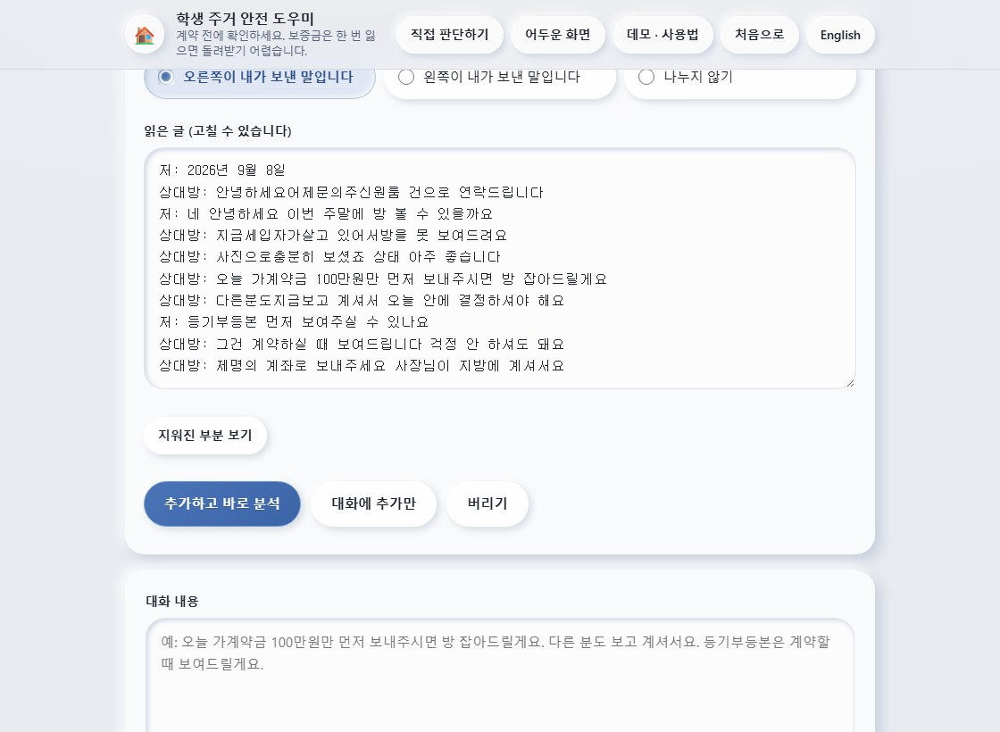

방향 선택은 나와 상대를 나눌 뿐 상대가 소유자나 중개인임을 증명하지 않는다. 결과 화면에서 역할을 별도로 확인한다. 기록된 초안에는 날짜 줄과 일부 띄어쓰기 오류가 남아 있다. 한국어 화면 캡처 과정에서 인식 글을 수동으로 고쳐 넣지는 않았다.

### OCR 구현 권장 프롬프트

```text
저장소에 포함된 Tesseract.js 워커로 한국어 대화를 인식하세요.
진행 상태와 중단을 제공하고, 분석 전에는 편집 가능한 검토 화면에서 멈추세요.
화자는 명시적으로 선택하게 하고 처음에는 미확인으로 두세요.
캡처를 전송하지 말고 가상 예시와 사용량 제한을 유지하세요.
중단, 초기화, 재시작과 인식 후 즉시 분석 흐름을 검사하세요.
워커를 종료하고 초기화 뒤 이전 응답을 무시하세요.
모의 검사뿐 아니라 실제 OCR 자료로도 검증하세요.
```

**구현 결과:** Tesseract.js 5.1.1과 저장소에 포함된 한국어 모델을 기기에서 실행한다. 두 가지 분할 시도의 결과를 조합해 초안을 제시한다. PNG/JPEG/WebP 최대 5장, 파일당 8 MiB, 합계 25 MiB, 이미지당 디코딩 픽셀 1,200만 개를 허용한다. 스크린샷을 업로드하지 않는다.

**한계:** 현재 OCR 언어는 한국어이다. 혼합 언어, 왜곡, 작은 글씨에서 오류가 날 수 있다. 동의받은 실제 휴대전화 캡처를 통한 평가는 남아 있다. 계약서 사진은 이 OCR 흐름으로 처리하지 않는다.

<!-- pagebreak -->

## 9. 시연 결과와 학습 예시

한국어 화면 캡처 기록은 assets/manual/ko/cases.json이다. 자료 해시, 실제 인식 글, 선택한 말풍선 방향, 평가와 신호가 포함된다. 캡처 스크립트는 실제 OCR과 규칙 분석을 실행했으며 결과를 모의로 만들지 않았다.

### 예시 A: 송금 압박

**관찰 결과:** strong_warning_signals, 점수에 반영된 신호 4개. 대화에는 송금을 서두르게 하는 말, 중개인 계좌 요구, 방을 보여 주지 않는 태도, 서류 제공을 미루는 말이 섞여 있다. 다음 질문을 정하기 전에 실제로 인용된 근거를 읽는다.

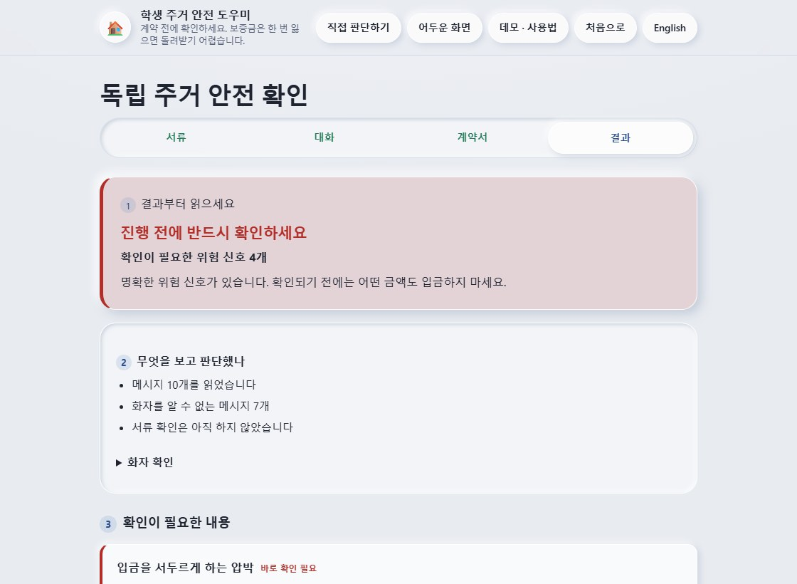

### 예시 B: 일반적인 대화

서로 다른 대화가 섞이지 않도록 초기화한 뒤 예시 B를 선택한다. 원본은 demo/screenshots/02-kakao-ordinary.jpg이다.

**관찰 결과:** no_known_signals, 점수에 반영된 신호 0개. 현재 규칙이 제공된 글에서 알려진 신호를 찾지 못했다는 뜻이다. 안전한 계약으로 확인되었다는 뜻은 아니다.

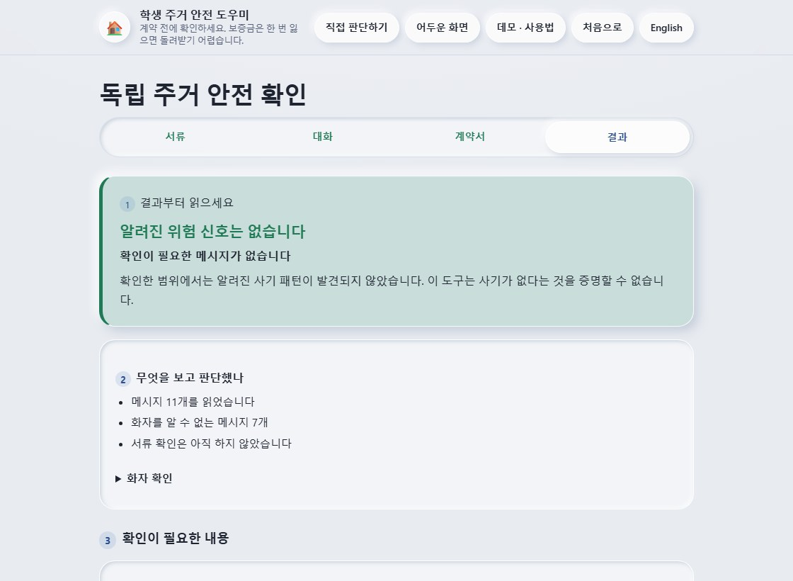

**단계 결과:** 서로 다른 입력에서 도구가 어떻게 반응하는지 비교할 수 있다. 두 예시는 정밀도, 재현율 또는 사기 탐지 정확도를 측정하는 자료가 아니다.

### 추가 연습 스크린샷 12개

[판단 도움말과 연습](https://s0lluxx26.github.io/Project_web_student_support/help.html)에서 스스로 확인하는 방법, 범주 필터, 내려받을 PNG와 원문을 제공한다. 예시를 바꿀 때 초기화하고 화자, 금액, 부정어를 확인한 뒤 OCR 글을 적용한다.

| 학습 범주 | 가상 예시 3개 | 검토한 원문의 기대 결과 |
|---|---|---|
| 일반적인 대화 | 서류 제공, 임차인의 송금 거절, 송금 압박 부인 | 알려진 위험 신호 없음 |
| 주의·추가 확인 | 짧은 정보, 대체 방 권유, 전해 들은 제한 | 정보 부족 또는 확인 필요 |
| 압박 | 정중한 송금 요구, 뒤늦은 요구, 방문 전 송금 | 뚜렷한 위험 신호 |
| 강한 위험 징후 | 제3자 계좌, 전입신고 제한, 신탁 동의 지연 | 뚜렷한 위험 신호 |

기대 결과는 assets/examples/cases.json에 정했으며 실제 초안과 결과는 observations.json에 별도로 기록했다. 기록된 브라우저 OCR 실행에서 12개 모두 글을 수정하지 않고 기대한 평가와 필수 신호에 도달했다. 일부 제목과 바닥글에는 인식 오류가 남아 있다. 3개 이미지는 어두운 대화 배경을 사용한다.

이 자료는 합성 회귀 테스트와 학습용 예시이다. 실제 휴대전화 캡처, 사기의 증명 또는 실제 정확도 측정이 아니다. 도움말은 일반적인 대화나 알려진 신호 없음에도 독립적인 확인이 필요한 이유를 설명하며 HUG와 정부 공식 안내를 연결한다.

<!-- pagebreak -->

## 10. 문서 확인과 개인정보를 고려한 내보내기

서류 확인 화면에서 요구 항목을 읽고 실제로 확인한 사실만 답한다. 계약서 단계는 사진을 보면서 확인 항목을 검토하는 기능이다. 계약서 OCR, 진위 확인, AI 계약 판정은 제공하지 않는다.

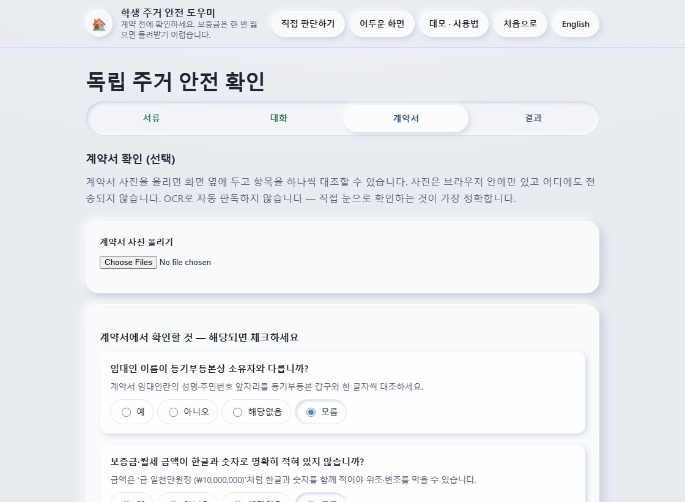

복사, 공유, 인쇄를 누르면 편집 가능한 미리보기가 열린다. 지원되는 형식의 전화번호, 계좌로 보이는 번호, 이메일 등의 식별자를 자동으로 가린다. 사람 이름이나 특이한 형식은 놓칠 수 있으므로 최종 동작 전에 직접 읽고 수정해야 한다.

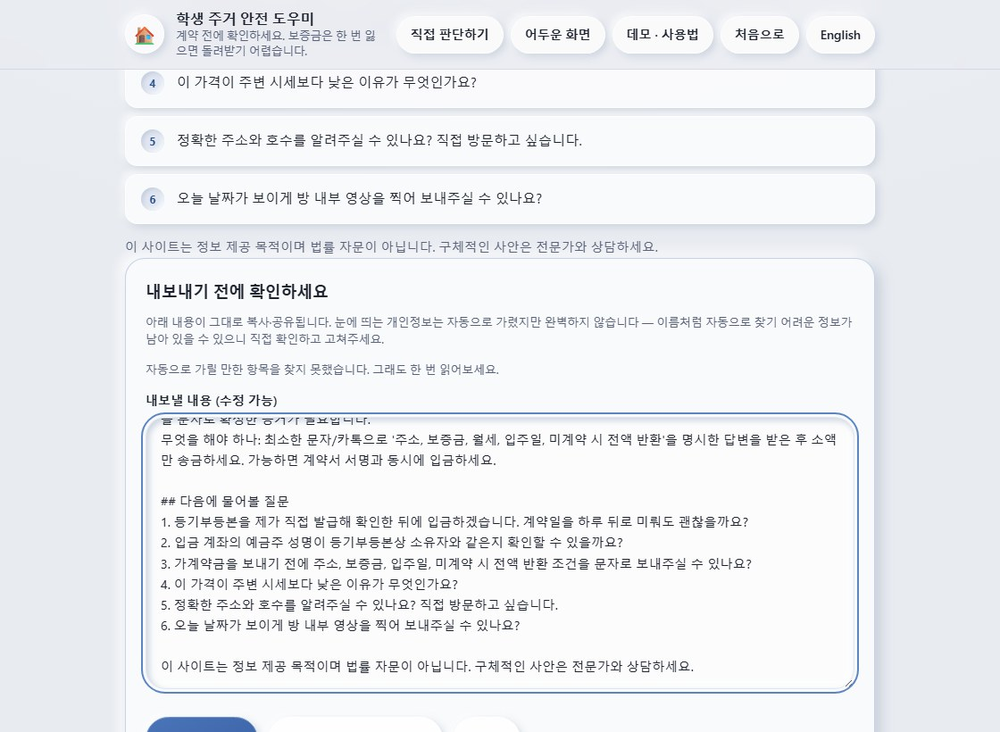

### 내보내기 구현 권장 프롬프트

```text
모르는 문서 답변을 그대로 유지하세요. 계약 이미지는 기기에만 두고
자동 판정이 없는 미리보기임을 명확히 표시하세요.
복사, 공유, 인쇄는 편집 가능한 개인정보 가림 미리보기를 거치게 하세요.
가려진 항목의 종류를 보여 주고, 원문 복구는 별도 선택으로 두세요.
완벽하게 가릴 수 있다고 주장하지 마세요.
입력이 바뀌면 이전 내보내기 초안을 무효화하세요.
브라우저 직접 인쇄로 원본 대화 근거가 노출되지 않는지 확인하세요.
```

**구현 결과:** 수동 확인은 OCR과 분리되어 있다. 복사·공유·인쇄는 검토한 미리보기를 사용한다. 주거 확인 화면을 브라우저에서 직접 인쇄하면 전용 미리보기를 이용하도록 안내한다. AI 초안은 보고서 내보내기에 포함하지 않는다. 초기화하면 입력, 이미지, 결과와 모델 상태를 정리한다.

<!-- pagebreak -->

## 11. 선택형 PC AI와 한계

경고가 있는 보고서에서 AI 설명 패널을 펼치고 한계를 읽는다. 지원되는 노트북이나 PC에서 실험 사용을 선택할 수 있으며, 체크만으로 모델을 내려받지 않는다.

그다음 모델 내려받기·캐시 불러오기를 누르거나, 이전에 받은 정확한 GGUF 파일을 선택한다. 준비가 끝나면 경고 하나를 골라 초안을 생성한다. 중단은 작업을 멈추고, 메모리 해제는 모델 메모리를 비우며, 저장된 모델 삭제는 현재 사이트 출처에 저장한 앱의 모델 파일을 지운다.

**모델 파일과 캐시:** 내려받거나 선택한 모델의 바이트를 사용해 방문자 기기에서 실행한다. 이후에는 검증된 브라우저 캐시를 재사용할 수 있다. 브라우저가 캐시를 삭제했거나 사용자가 지웠다면 다시 내려받을 수 있다. 다른 사이트 주소는 별도 저장 공간을 사용한다. 패널에 현재 모델이 다운로드, 검증된 캐시, 로컬 파일 중 어디서 왔는지 표시한다.

휴대전화와 태블릿에서는 AI를 활성화할 수 없다. 기기 힌트, 모바일 사용자 에이전트, 데스크톱 모드 iPad의 터치 특성을 참고한다. PC 창이 좁다는 이유만으로 막지는 않는다. 기기 구분은 최선의 추정이며 성능 보장은 아니다. 모바일에서도 글 분석과 OCR은 사용할 수 있다.

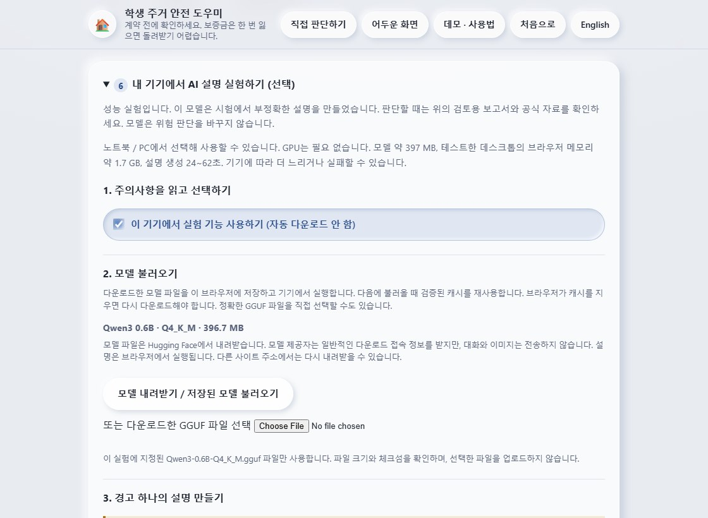

화면은 사용 선택, 모델 불러오기, 경고 설명의 세 단계로 나뉜다. 생성 버튼 앞에 측정된 대기 시간과 느린 노트북에서는 몇 분이 걸리거나 실패할 수 있다는 안내가 있다. 실행 중 상태에도 안내를 반복한다. 기다리는 동안 규칙 보고서를 읽거나 중단할 수 있다.

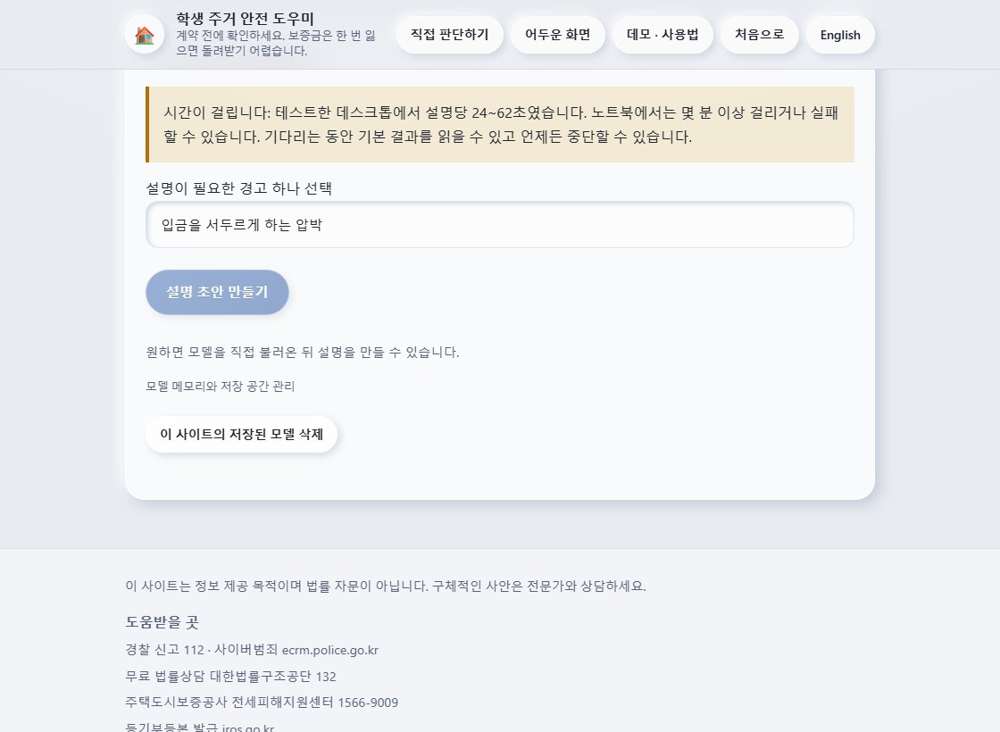

### 실행 환경과 측정 비용

- Wllama 3.6.1은 워커에서 WebAssembly를 통해 llama.cpp를 실행한다.
- 고정 모델은 Qwen3 0.6B Q4_K_M이며 파일 크기는 396,705,472바이트, 약 397 MB이다.
- 로컬 파일과 캐시도 사용 전에 크기와 SHA-256을 검증한다.
- 현재 설정의 GPU 레이어 수는 0이다. GPU가 없어도 실행할 수 있다.
- 기본 GitHub Pages와 Vercel 환경은 CPU 스레드 하나를 사용한다.
- Windows i7-14700KF, RAM 약 32 GiB의 데스크톱에서 합성 설명 20건은 24.27-62.02초, 중앙값 34.89초였다.
- 모델을 불러온 뒤 측정한 브라우저 프로세스 그룹의 작업 집합 메모리는 약 1.72 GB였다. 최대치나 모델만의 정확한 메모리 사용량은 아니다.
- 다른 노트북에서는 더 느리거나 실패할 수 있다. 일반 노트북이나 휴대전화에서 얻은 측정값이 아니다.

[Wllama 문서](https://github.com/ngxson/wllama)는 브라우저 CPU 추론과 선택적인 GPU 지원을 설명한다. 이 프로젝트의 선택 설정은 CPU 전용이다.

### 모델 입력과 출력의 경계

도우미는 기존 규칙의 발견 내용 하나를 설명한다. 원본 메시지, 스크린샷, 계약서 사진을 모델에 전달하지 않는다. 출력은 규칙 평가를 대체할 수 없다. 스키마 검사는 잘못된 형식, 존재하지 않는 발견 ID 등을 거절하지만 사실 정확성까지 증명하지는 않는다.

### AI 기능 구현 권장 프롬프트

```text
규칙 보고서를 기본 결과로 유지하세요. PC에서 선택해 쓰는 AI 패널을 만들고
휴대전화와 태블릿에서는 비활성화하세요. 화면 너비만으로 기기를 판단하거나
GPU를 필수 조건으로 만들지 마세요.
모델 크기, 측정된 메모리와 시간, 품질 한계를 사용 전에 보여 주세요.
명시적인 불러오기 동작 전에는 다운로드하지 마세요.
고정 모델의 크기와 SHA-256을 검증하세요.
사용자 대화 대신 선택한 규칙 하나의 안내만 전달하세요.
초안은 글로 렌더링하고 내보내기에 넣지 마세요.
중단, 메모리 해제, 캐시 삭제와 초기화를 검사하세요.
모바일 차단과 WebGPU 없는 PC, 실패 복구를 테스트하고 측정값을 만들지 마세요.
```

**구현 결과:** 특별한 URL 없이 PC 보고서에서 실험을 선택할 수 있다. 모바일에는 비활성화 이유를 표시한다. OCR을 시작하면 LLM을 해제하고, LLM을 시작하면 OCR 자원을 해제한다. 생성에 실패해도 규칙 보고서는 유지한다.

### 품질에 관한 실제 근거

기존 20건 실행에서 19건이 구조 검사를 통과했다. 이것은 정확도 95%라는 뜻이 아니다. 사람이 읽었을 때 조건 변경, 모순, 템플릿 자리표시자 복사 등이 통과한 답변에서도 발견되었다. 한국어 요청에 영어로 응답한 한 건은 거절되었다.

운영 중인 GitHub Pages에서도 실제 추론을 확인했다. 기록된 한 실행에서는 로컬 GGUF 불러오기 3.45초, 생성 44.86초가 걸렸고 별도 생성의 중단도 확인했다. 이는 실행 가능성을 보여 주며 조언의 정확성을 보장하지 않는다.

따라서 기능은 명확한 주의 문구가 있는 선택형 실험으로 유지한다. 작은 모델은 자연스럽지만 틀린 설명을 만들 수 있다. 더 큰 모델이나 Vercel로 바꾸는 것만으로 품질이 검증되지는 않는다.

**근거:** [구현 및 측정 문서](https://github.com/S0lluxx26/Project_web_student_support/blob/main/docs/BROWSER_LLM_OPTIONS.md)와 docs/benchmarks/의 기록. 한국어판 제작 과정에서 모델 성능을 새로 측정했다고 주장하지 않는다.

**단계 결과:** 실행과 한계를 검증할 수 있는 기기 내 설명 실험을 제공한다. AI가 사기 여부를 확정하는 기능은 아니다.

<!-- pagebreak -->

## 12. 데모와 보고서 재현 방법

헤더의 데모·사용법은 demo.html을 연다. 예시 내려받기, OCR 시작, 검토, 결과, 서류, 내보내기, PC 도우미를 한국어와 영어로 안내한다. Markdown과 PDF를 내려받을 수 있다.

공개 화면에는 가상 자료만 사용한다. 기존 예시 2개는 assets/manual/에, 추가 PNG 12개와 기록은 assets/examples/에 있다. 한국어 화면과 인식 기록은 assets/manual/ko/에 따로 저장한다. 계약 화면은 실제 계약 사진 없이 확인 항목을 보여 준다. 시연에 인터넷 계약서 사진을 사용할 필요는 없다.

### 데모 및 문서 제작 권장 프롬프트

```text
기존 가상 카카오톡 자료로 한국어·영어 데모를 만드세요.
Playwright와 실제 OCR로 앱 화면을 캡처하고,
경고 사례와 일반 사례를 절차와 한계와 함께 보여 주세요.
화면이나 측정 결과를 꾸미지 말고 비공개 대화나 허가 없는 계약 사진을 쓰지 마세요.
제작자 Bui Xuan Mai와 저장소 주소를 표기하세요.
아키텍처, AI 프롬프트, 구현 단계와 관찰 결과를 Markdown으로 작성하세요.
한국어판에는 번역된 그림과 실제 한국어 화면을 넣으세요.
내용과 제작자 표기를 먼저 검토한 뒤 같은 Markdown으로 PDF를 만드세요.
```

### 화면과 자료 다시 만들기

```sh
npm run assets:stamp
node scripts/capture-manual.mjs --lang ko
```

바뀐 화면과 assets/manual/ko/cases.json을 검토한다. 사용법이나 결과가 바뀌면 한국어 Markdown도 수정한다. 영문 캡처는 npm run demo:capture로 별도로 생성한다. 한국어 생성 명령은 영문 파일을 덮어쓰지 않는다.

추가 연습 이미지 12개는 다음 명령으로 다시 만들고 관찰 기록을 갱신한다.

```sh
python scripts/make-learning-screenshots.py
npm run build
node scripts/smoke-learning.mjs --record
```

이미지는 Pillow와 한글 글꼴로 생성한다(EXAMPLE_FONT로 Windows 기본 글꼴 변경). 이미지·실제 OCR 초안·수정 여부를 검토하고, 실패를 숨기려고 기대 결과를 바꾸지 않는다. npm run test:learning은 기록을 갱신하지 않는다.

### 학습 기능 개선 권장 프롬프트

```text
docs/AI_PROMPTS.md와 현재 로직 검토 기록을 먼저 읽으세요.
일반, 정보 부족, 압박, 강한 위험 신호를 다루는 가상 예시를 추가하고
각 예시에 독립적인 기대 결과와 설명을 정하세요.
스크린샷 OCR과 검토된 글의 규칙 분석을 구분해 검사하세요.
수정한 부분을 기록하고 실존 인물의 대화나 식별자를 넣지 마세요.
스스로 검증하는 방법을 가르치는 양언어 도움말을 제공하세요.
알려진 신호 없음과 안전 확인을 구분하고 결과 순서를 번호로 표시하세요.
밝은 화면과 어두운 화면, 모델 캐시 재사용, 긴 생성 시간을 안내하세요.
배포 전 검사를 실행하고 실제 정확도라고 과장하지 마세요.
```

### 한국어 PDF 다시 만들기

Python에 reportlab, pypdf, Pillow를 준비한 뒤 검토된 Markdown을 변환한다. 일반 설치나 사이트 사용에는 이 문서 생성 환경이 필요하지 않다.

```sh
python scripts/build-guide-pdf.py --lang ko
```

입력은 manual/PROJECT_GUIDE_KO.md와 상대 경로의 이미지이다. 결과는 output/pdf/project-guide-ko.pdf와 내용이 동일한 공개 복사본 manual/project-guide-ko.pdf이다. Windows에서는 맑은 고딕을 사용한다. 다른 환경에서는 GUIDE_FONT와 GUIDE_FONT_BOLD에 한글을 지원하는 TrueType 글꼴 경로를 지정한다. 스크립트가 글꼴을 설치하지는 않는다.

**검토 순서:** Markdown 내용, 명령, 링크, 제작자를 먼저 확인한다. PDF를 만든 뒤 글을 추출해 누락을 검사하고 모든 페이지를 이미지로 렌더링해 배치와 한글을 확인한다. 이후 사이트 빌드를 다시 생성한다.

### 한국어 Mermaid 그림 다시 만들기

원본은 docs/diagrams/ko/에 있다. Mermaid는 docs/report-tools/로 분리되어 있으며 Node.js 22.12 이상과 설치된 Playwright Chromium이 필요하다.

```sh
npm ci --prefix docs/report-tools --ignore-scripts
node scripts/render-report-diagrams.mjs --lang ko
python scripts/build-guide-pdf.py --lang ko
npm run build
npm run test:report
```

Mermaid 원본과 Markdown 블록을 함께 수정한다. 렌더러는 assets/manual/diagrams/ko/에 SVG, PNG와 검증용 해시를 기록한다. PDF는 이 그림을 사용하며 온라인 렌더링 서버에 접속하지 않는다. 목차와 책갈피는 보고서 제목에서 만든다.

**단계 결과:** Bui Xuan Mai를 제작자로 표시한 한국어 사용 설명서와 재현 가능한 기술 보고서를 제공한다. 영문판은 별도로 유지한다.

<!-- pagebreak -->

## 13. 검증과 배포

커밋 전에는 다음 검사를 실행한다.

```sh
npm run assets:stamp
npm run build
npm run test:ocr
npm run test:browser
npm run test:report
```

빌드 과정에서 단위 및 데이터 검사를 실행하고, 공개 허용 파일만 복사한 뒤 바이트가 같은지 확인한다. 실제 OCR 검사는 합성 이미지로 수행한다. 브라우저 검사는 화면 이동, 중단과 초기화, 개인정보, 호스트 경로, 선택형 AI 제어와 설명서 리소스를 검사한다. 모의 LLM 검사는 연결 동작을 검증하며 모델의 설명 품질을 측정하지 않는다.

모델이나 실행 라이브러리를 바꿨다면 실제 모델 검사를 별도로 실행하고 문장의 의미도 검토한다.

```sh
npm run bench:llm -- --model tmp/models/Qwen3-0.6B-Q4_K_M.gguf --cases 20
```

### GitHub와 GitHub Pages

1. git status와 git diff를 검토하고 의도한 코드, 문서, 공개 자료만 추가한다.
2. 권한이 있는 Git 계정으로 main에 커밋하고 푸시한다. SSH 비밀 키는 저장소와 배포 파일 밖에 둔다.
3. 저장소 Settings > Pages에서 배포 원본으로 GitHub Actions를 사용한다.
4. 워크플로가 고정된 의존성을 설치하고 빌드, 보고서 검사, 실제 OCR 및 브라우저 검사를 통과한 뒤 dist/만 업로드한다.
5. 배포 작업이 성공하면 실제 홈페이지, 데모, 한국어 Markdown과 PDF를 열고 새 링크와 스크린샷 분석 흐름을 확인한다.

```sh
git status --short
git diff --stat
git add <reviewed-files>
git commit -m "Describe the verified change"
git push origin main
```

reviewed-files는 실제 검토한 파일 경로로 바꾸는 자리표시자이다. 꺾쇠까지 그대로 실행하지 않는다. 대상 저장소는 https://github.com/S0lluxx26/Project_web_student_support 이다.

### 선택 사항: Vercel 배포

같은 Git 저장소를 Vercel 계정으로 가져온다. 프로젝트 루트는 저장소 루트로 두고 Other/정적 사이트 설정과 vercel.json을 유지한다. 설정은 npm ci로 의존성을 설치하고 node scripts/build-vercel.mjs로 빌드한 뒤 dist/를 공개한다.

이는 두 번째 정적 호스트를 제공한다. 서버 측 모델이나 클라우드 AI 키를 만들지 않는다. 계정과 프로젝트 연결은 아직 필요하며 실제 Vercel 운영 주소를 제시하지 않는다. [Vercel 빌드 설정](https://vercel.com/docs/builds/configure-a-build)을 참고한다.

**단계 결과:** 동일한 검증 산출물을 도메인 루트와 GitHub Pages의 저장소 하위 경로에서 사용할 수 있다. 기본 공개 주소는 표지의 GitHub Pages 링크이다.

<!-- pagebreak -->

## 14. 성과와 한계 및 남은 과제

### 현재 시연할 수 있는 결과

| 항목 | 관찰 가능한 결과 | 근거 |
|---|---|---|
| 화면 | 글, 스크린샷, 데모 진입점 | index.html과 홈 캡처 |
| 규칙 | 27개 패턴, 근거와 평가 상태 | patterns.json과 분석기 테스트 |
| OCR | 실제 한국어 인식 후 편집과 적용 | 캡처 기록, 실제 OCR 검사 |
| 압박 예시 | 점수에 반영된 신호 4개 | assets/manual/ko/cases.json과 결과 화면 |
| 일반 예시 | 점수에 반영된 신호 0개 | 같은 기록과 일반 결과 화면 |
| 학습 예시 | 추가 12개가 실제 OCR로 기대 결과에 도달 | assets/examples/observations.json, 합성 자료 |
| 읽기와 도움말 | 번호 6개, 밝고 어두운 테마, 직접 확인 방법 | help.html과 화면 검사 |
| 서류와 내보내기 | 수동 확인과 편집 가능한 미리보기 | 계약·내보내기 화면과 브라우저 검사 |
| 선택형 AI | PC에서 명시적 선택, 모바일 비활성화, GPU 불필요 | 지원 정책, 워커 설정, 테스트 |
| 실제 모델 | Pages에서 실행, 의미 오류 관찰 | 저장소의 모델 측정 기록 |
| 배포 | 공통 dist/, GitHub 운영, Vercel 설정 지원 | 워크플로, 빌드 스크립트와 vercel.json |
| 한국어 문서 | 15개 장, 한국어 그림과 실제 화면, 제작자와 주소 | 이 Markdown과 생성 PDF |

### 아직 필요한 작업

- 동의받은 실제 휴대전화 캡처로 OCR을 평가하고, 사람이 검토한 글과 화자 정답을 마련한다.
- 대표적인 노트북에서 성능과 사용성을 측정한다. 휴대전화 OCR은 별도로 검사한다. 선택형 LLM은 모바일에서 비활성화되어 있다.
- 27개 패턴의 법률 표현과 수치 기준을 최신 공식 자료와 대조하고 적절한 분야 검토를 받는다.
- 학습 분류기 전에 동의받은 라벨 데이터를 마련한다. 대화와 출처 단위로 분리하고 놓친 사례와 오탐을 함께 보고한다.
- 두 번째 호스트가 필요한 경우에만 Vercel 계정을 연결하고 실제 동작을 확인한다.
- 플랫폼 연동 전에 현장 조사를 수행한다. 직방 수집이나 현장 조사 결과가 이미 있다고 주장하지 않는다.

### 문제 해결

- **파일을 직접 열었더니 실패한다:** 로컬 HTTP 서버로 실행한다.
- **OCR이 비거나 틀리다:** 더 선명한 한국어 이미지나 수정한 글을 사용하고 금액과 부정어를 확인한다.
- **AI 사용이 비활성화되어 있다:** 휴대전화·태블릿은 의도적으로 차단한다. 필수 브라우저 기능이 없는 경우에도 제한될 수 있다.
- **모델을 불러오지 못한다:** 연결을 확인하거나 정확한 GGUF 파일을 선택한다. 파일 크기나 해시가 다르면 거절된다.
- **다른 주소에서 다시 내려받는다:** 사이트 출처마다 캐시가 분리되어 있다.
- **위험 신호가 없다:** 실제 입력과 확인 범위를 다시 읽는다. 일치 없음은 안전의 증명이 아니다.

<!-- pagebreak -->

## 15. 참고 자료와 용어

### 주요 기술 자료

- [프로젝트 저장소](https://github.com/S0lluxx26/Project_web_student_support)
- [GitHub Pages 정적 호스팅 안내](https://docs.github.com/en/pages/getting-started-with-github-pages/what-is-github-pages)
- [Vercel 빌드 설정](https://vercel.com/docs/builds/configure-a-build)
- [Tesseract.js 문서와 소스](https://github.com/naptha/tesseract.js)
- [Wllama 브라우저용 llama.cpp 연동](https://github.com/ngxson/wllama)
- [고정된 모델 저장소](https://huggingface.co/unsloth/Qwen3-0.6B-GGUF/tree/50968a4468ef4233ed78cd7c3de230dd1d61a56b)
- [프로젝트 OCR 문서](https://github.com/S0lluxx26/Project_web_student_support/blob/main/docs/OCR.md)
- [프로젝트 모델 측정 기록](https://github.com/S0lluxx26/Project_web_student_support/blob/main/docs/BROWSER_LLM_OPTIONS.md)
- [현재 프로젝트 계획](https://github.com/S0lluxx26/Project_web_student_support/blob/main/PLAN.md)

구현 및 캡처 확인 기준일은 2026년 9월 12일이다. 외부 문서는 바뀔 수 있으며, 이 판본의 동작과 수치는 저장소의 고정된 파일과 기록을 기준으로 설명한다. 번역을 위해 새로운 법률 판단이나 측정 결과를 추가하지 않았다.

### 프롬프트와 설치 참고 자료

- [AI 프롬프트 모음: docs/AI_PROMPTS.md](https://github.com/S0lluxx26/Project_web_student_support/blob/main/docs/AI_PROMPTS.md)
- [PC 설치 및 AI 설치 프롬프트: INSTALL.md](https://github.com/S0lluxx26/Project_web_student_support/blob/main/INSTALL.md)
- [Mermaid 흐름도 문법](https://mermaid.js.org/syntax/flowchart.html)
- [Mermaid 시퀀스 다이어그램 문법](https://mermaid.js.org/syntax/sequenceDiagram.html)
- [한국어 Mermaid 원본](https://github.com/S0lluxx26/Project_web_student_support/tree/main/docs/diagrams/ko)
- [영문 보고서](https://github.com/S0lluxx26/Project_web_student_support/blob/main/manual/PROJECT_GUIDE.md)

### 용어 정리

| 용어 | 이 프로젝트에서의 의미 |
|---|---|
| OCR | 이미지에서 편집 가능한 글을 추출하는 기술 |
| 규칙 분석기 | 검토된 문구와 개념 규칙으로 위험 신호를 찾는 구성 요소 |
| LLM | 실험적인 설명 문장을 생성하는 언어 모델 |
| 워커 | 화면 실행 흐름과 분리된 브라우저 백그라운드 실행 공간 |
| WASM | 방문자 기기에서 실행하는 WebAssembly 코드 |
| OPFS | 모델 캐시를 보관하는 사이트 출처 전용 브라우저 파일 저장 공간 |
| GGUF | Wllama에 선택한 모델 가중치 파일 형식 |
| CI | 배포 전 GitHub Actions에서 자동 검사를 실행하는 절차 |
| dist/ | 전체 저장소가 아닌 공개 사이트용 생성 산출물 |

**추적 정보:** 한국어판은 코드 커밋 c7fc32b와 같은 커밋의 영문 보고서를 기준으로 작성했다. 한국어 화면에서도 기존 두 예시의 신호 수는 각각 4개와 0개로 확인했다. 번역 과정에서 서버 추론이나 새 분류 모델을 추가하지 않았다.
